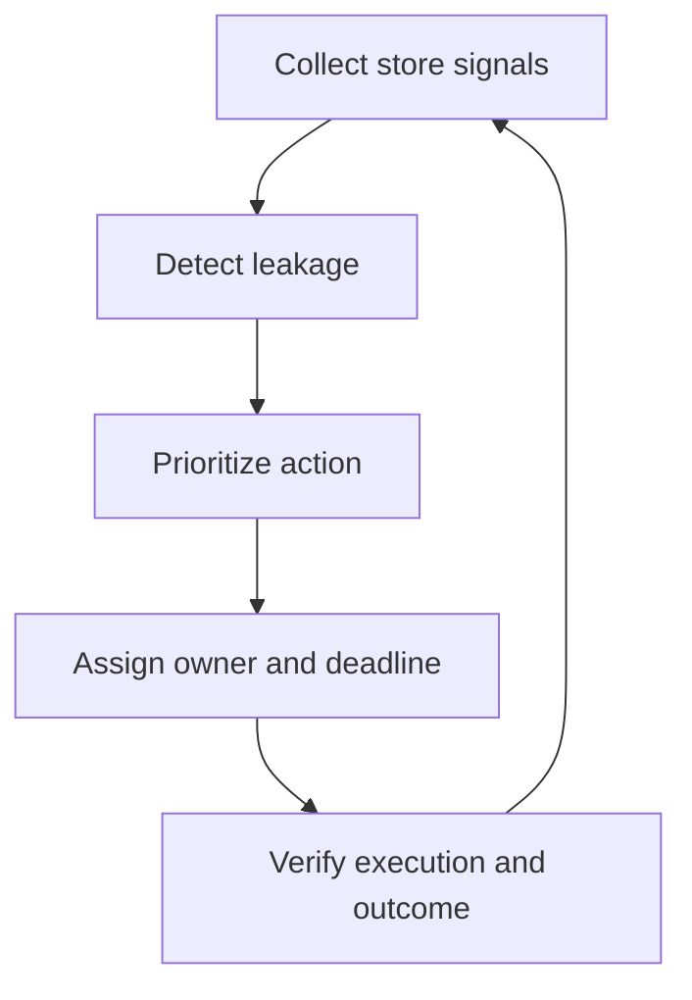

# AtlasNow — Business & Product Blueprint

> [!success] Founder decision
> **P2P Labs** adalah company dan technology builder. **AtlasNow** adalah produknya. AtlasNow bukan holding company dan bukan sekadar dashboard GSC/GBP.

## 1. Product thesis

### Vision

> **AtlasNow menunjukkan cabang mana yang kehilangan visibility, lead, atau revenue—kemudian mengubah setiap sinyal menjadi tindakan yang memiliki PIC, deadline, dan bukti hasil terhadap dampak revenue.**

### English vision

> **AtlasNow shows which locations are losing visibility, leads, or revenue—then turns every signal into an accountable action with an owner, deadline, and proof of impact.**

### Category

**Multi-Location Revenue Operations**

### Primary tagline

**Optimize Every Location. Capture More Demand.**

### Hero headline

**Your outlets are already on the map. Now make every one perform.**

### Core product promise

**Turn existing Google presence into measurable local growth.**

### Growth communication flow

Optimize location assets → Increase visibility → Capture customer demand → Drive actions → Generate measurable outcomes

### Ops tagline (internal / Control Tower)

**Know what every store needs now.**

### Sales headline

**See every store. Fix every leak.**

### Outcome line

**Turn local demand into store revenue.**

### One-line product definition

AtlasNow adalah control tower untuk HQ bisnis multi-cabang yang menggabungkan Google Search, Google Business Profile, local advertising, social account cabang, voucher, dan WhatsApp menjadi prioritas tindakan per lokasi.

## 2. Brand architecture

| Layer | Name | Fungsi |
|---|---|---|
| Company | **P2P Labs** | Membangun produk, data infrastructure, dan IP |
| Product | **AtlasNow** | Software Multi-Location Revenue Operations |
| Managed service | **P2P Local Growth — Powered by AtlasNow** | Setup, monitoring, optimization, dan execution support |

> [!important] Positioning boundary
> AtlasNow boleh memiliki visi **Local Revenue OS**, tetapi MVP harus dijual sebagai **Local Demand-to-Action Control Tower** sampai voucher, booking, WhatsApp disposition, atau POS benar-benar terhubung.

## 3. Problem yang diselesaikan

HQ bisnis multi-cabang biasanya mengetahui total traffic dan total sales, tetapi tidak dapat menjawab secara cepat:

1. Cabang mana yang kehilangan visibility di Google Search atau Maps?
2. Cabang mana yang punya demand tetapi kehilangan potential visitor karena profil tidak sehat, rating buruk, atau respons lambat?
3. Cabang mana yang tidak menjalankan instruksi marketing pusat?
4. Campaign, post, atau voucher mana yang memicu tindakan customer?
5. Siapa PIC yang harus bertindak, kapan deadline-nya, dan apa bukti eksekusinya?
6. Apakah intervensi menghasilkan perbaikan signal, lead, redemption, atau revenue?

### Job to be done

> Ketika performa puluhan cabang tidak seragam, HQ ingin mengetahui lokasi mana yang perlu diintervensi sekarang, penyebabnya, tindakan yang harus dilakukan, PIC-nya, dan apakah tindakan tersebut berhasil.

## 4. Product operating loop



AtlasNow bukan tempat berhenti di chart. Setiap signal yang material harus berakhir pada satu dari tiga status:

- `No action needed`
- `Action assigned`
- `Measurement blocked`

## 5. Sample implementation: Vilo Gelato

Sample publik: [Vilo Gelato Outlets](https://vilogelato.com/outlets).

### Kondisi yang terlihat dari website publik

- Website menyatakan memiliki **36+ cabang** dan menampilkan outlet lintas beberapa kota.
- Seluruh outlet muncul dalam satu URL `/outlets`.
- Setiap kartu menampilkan nama, alamat, dan link peta.
- Website menampilkan satu nomor WhatsApp HQ di footer.
- Tidak terlihat URL landing page unik untuk setiap cabang pada halaman tersebut.

### Implikasi terhadap AtlasNow

> [!warning] GSC belum bisa menjadi store-level
> Karena puluhan lokasi berada pada satu URL, GSC hanya dapat mengukur halaman `/outlets` secara agregat. AtlasNow memerlukan URL unik seperti `/outlets/vilo-menteng` agar query, click, CTR, indexation, CTA, dan voucher dapat dipetakan ke cabang.

### Target foundation untuk sample

```text
vilogelato.com/outlets/{branch-slug}
↕
atlas_location_id
↕
GBP location ID + storeCode + Place ID
↕
Ads location asset + branch voucher
↕
WAHA session/WhatsApp number
↕
Social account cabang yang memang sudah ada
```

### Prinsip social account

- Capture akun HQ.
- Capture akun cabang **hanya yang sudah ada**.
- Jangan memaksa semua cabang membuat akun sosial pada MVP.
- Tandai scope akun sebagai `HQ`, `REGION`, `LOCATION`, atau `UNKNOWN`.
- Data performa hanya ditarik jika akun terotorisasi dan API platform mengizinkan.
- Bila belum terotorisasi, simpan URL, handle, owner, dan status akses sebagai registry—bukan mengarang metric.

## 6. Canonical Location Graph

Satu objek paling penting di AtlasNow adalah `atlas_location_id`.

```text
atlas_location_id
├── tenant_id / brand_id
├── branch name / store code / slug
├── GBP location ID / Place ID / Maps URI
├── branch landing-page URL / GSC page pattern
├── GA4 store_id
├── Ads location asset / location group
├── GBP voucher series / Ads voucher series
├── WAHA session / WhatsApp account
├── social accounts[]
└── POS or redemption store ID
```

### Minimum location record

| Field | Purpose |
|---|---|
| `atlas_location_id` | Immutable internal key |
| `brand_id` | Brand owner |
| `store_code` | Client operational code |
| `name`, `slug` | Display and URL mapping |
| `city`, `region`, `timezone` | Reporting and peer grouping |
| `format`, `age_band`, `catchment_type` | Apple-to-apple benchmark |
| `gbp_location_id`, `place_id` | GBP and Maps mapping |
| `branch_url` | GSC/GA4 mapping |
| `whatsapp_scope` | HQ or branch account |
| `social_accounts[]` | Existing authorized accounts |
| `operating_status` | Open, temporary closed, renovation, etc. |

> [!danger] No mapping, no recommendation
> Jika source belum terhubung dengan confidence yang cukup, AtlasNow harus menampilkan `Data Not Ready` atau `Mapping Conflict`, bukan recommendation palsu.

## 7. Scope keputusan 1–7

| # | Founder direction | Locked product decision |
|---:|---|---|
| 1 | Setup GSC dan tarik social HQ/cabang yang sudah ada | Masuk **AtlasNow Foundation**. Store-level GSC mensyaratkan branch URL; social memakai registry + authorized connector |
| 2 | Voucher dari GBP untuk inisiasi transaksi | Gunakan **GBP Offer Post**, unique code per source × location × period, lalu rekam redemption |
| 3 | Search Ads dengan voucher dan location asset | Search campaign + location asset/group + promotion/landing-page offer; code Ads dipisah dari GBP organic |
| 4 | Monitoring performance, reviews, dan visit intent cukup untuk MVP | Masuk MVP sebagai **demand and experience signals**; directions tidak disebut store visits |
| 5 | GBP Performance, Reviews, dan Posts harus presisi lewat API | Setiap card memiliki Metric Data Contract, endpoint, enum, date range, timezone, last sync, dan reconciliation |
| 6 | Pelajari WAHA untuk nomor HQ dan cabang | WAHA menjadi optional **Conversation Observability Bridge** pada Phase 2, satu session per nomor |
| 7 | Identifikasi siapa yang masuk dan isi conversation untuk analisis | Capture inbound identity bila tersedia, text/media metadata, response SLA, intent, sentiment, dan unresolved demand; raw content dibatasi |

## 8. Product modules and phases

### Phase 0 — AtlasNow Foundation

Tujuan: membuat data cabang dapat dihubungkan dan dipercaya.

- Location Master dan `atlas_location_id`.
- Google account, OAuth, GBP manager access, dan API access approval.
- GSC domain property dan sitemap.
- Branch landing page per outlet.
- LocalBusiness schema dan URL convention.
- GA4 event + `store_id`.
- UTM standard.
- Social Account Registry HQ dan cabang yang sudah ada.
- Data readiness score dan source mapping review.

**Output agency:** one-time setup, data-health audit, branch URL blueprint, dan integration map.

### Phase 1 — AtlasNow Control

Tujuan: mengetahui cabang mana yang perlu tindakan sekarang.

- HQ Control Tower.
- Store Leakage Matrix.
- Location 360.
- GBP Performance.
- Review inbox dan issue analysis.
- Post inventory, status, dan freshness.
- GSC query/page/indexation signals.
- Social account capture dan freshness signals.
- Alerts, recommendation, task, PIC, SLA, dan proof.

**MVP promise:** detect one leak → assign one action → verify one result.

### Phase 1.5 — AtlasNow Convert Lite

Tujuan: membangun transaction bridge tanpa menunggu integrasi POS penuh.

- GBP Offer Posts.
- Unique voucher series.
- Search Ads with location assets.
- Promotion assets atau branch landing-page offer.
- Voucher claim/redeem tracking.
- CSV/manual redemption import.
- Verified redemption dashboard.

### Phase 2 — AtlasNow Conversation

Tujuan: mengetahui siapa yang masuk ke WhatsApp HQ/cabang, membahas apa, dan apakah dijawab.

- WAHA connector sebagai bridge untuk nomor existing.
- Satu WAHA session per WhatsApp account.
- Session metadata dipetakan ke tenant dan location.
- Inbound and outbound event capture.
- Conversation segmentation.
- First-response time, response rate, unanswered, and after-hours queue.
- Intent, complaint, product, outlet, urgency, and sentiment classification.
- Branch/HQ routing analysis.
- Official WhatsApp Business Platform migration path.

### Phase 3 — AtlasNow Revenue

Tujuan: menghubungkan actions ke business outcomes.

- POS, booking, order, or CRM integration.
- Voucher-to-transaction match.
- Lead disposition and lost reason.
- Revenue, gross margin, promo cost, and contribution profit.
- Verified attributed sale.

### Phase 4 — AtlasNow Intelligence

Tujuan: merekomendasikan intervensi dan alokasi budget yang lebih baik.

- Peer-group benchmark.
- Next-best action.
- Test vs control stores.
- Budget reallocation.
- Vertical playbooks.
- Estimated incrementality with confidence labels.

## 9. GBP capability blueprint

### 9.1 Business Information and location health

AtlasNow dapat membaca dan mengelola, sesuai authorization dan approval:

- store code, title, phone, categories;
- storefront address, website URI;
- regular, special, and more hours;
- labels, open status, profile description;
- metadata dan location state;
- Voice of Merchant, verification, ownership conflict, suspension/disabled state.

### 9.2 Performance

Daily metrics resmi yang relevan:

- Desktop Maps impressions.
- Desktop Search impressions.
- Mobile Maps impressions.
- Mobile Search impressions.
- Conversations.
- Direction requests.
- Call clicks.
- Website clicks.
- Bookings.
- Food orders.
- Food menu clicks.

Monthly search keywords dikembalikan sebagai actual value atau privacy threshold. AtlasNow harus menampilkan `< threshold` bila Google tidak memberi exact value.

### 9.3 Reviews

AtlasNow dapat:

- list/get review;
- membaca reviewer, rating, comment, create/update time, media;
- mengetahui ada/tidaknya reply;
- mengirim/update reply dengan approval;
- menghapus owner reply;
- membaca moderation state `PENDING`, `REJECTED`, atau `APPROVED`;
- membaca policy violation untuk reply yang ditolak;
- menerima Pub/Sub event untuk new/updated review.

Review analysis AtlasNow:

- service, staff, wait time, cleanliness, stock, product, price, ambience, access/parking;
- sentiment, severity, recurring theme;
- response SLA;
- unresolved negative review;
- issue-to-action mapping.

> [!warning] Boundary
> Review adalah experience signal. Ia bukan representasi seluruh customer, bukan store visit count, dan bukan transaksi.

### 9.4 Posts and offers

AtlasNow dapat create/get/list/patch/delete:

- Standard Post.
- Event Post.
- Offer Post.
- Scheduled and recurring post.

Offer Post mendukung:

- coupon code;
- redemption URL;
- terms and conditions;
- event schedule;
- media source URL;
- post lifecycle state.

Post insight yang relevan:

- views on Google Search;
- CTA clicks;
- maksimum 100 post names per insight request;
- insight request time range maksimum 18 bulan.

### 9.5 Notifications

Pub/Sub event yang masuk MVP:

- Google Update.
- New Review.
- Updated Review.
- New Customer Media.
- Duplicate Location.
- Voice of Merchant Updated.

Q&A event tidak dibangun karena Q&A API dihentikan pada 3 November 2025.

### 9.6 Precision rules

Setiap KPI wajib memiliki **Metric Data Contract**:

| Contract field | Example |
|---|---|
| Source | GBP Performance API |
| Endpoint | `locations.fetchMultiDailyMetricsTimeSeries` |
| API metric | `CALL_CLICKS` |
| UI label | Call-button clicks |
| Definition | Click pada tombol call, bukan answered call |
| Scope | One GBP location |
| Range/timezone | 1–31 July, Asia/Jakarta |
| Freshness | Last sync + source latency status |
| Formula | Sum of dated values |
| Coverage | 34/36 connected locations |
| Caveat | Platform-reported intent signal |

## 10. Voucher and Ads blueprint

### Voucher code structure

```text
{SOURCE}-{LOCATION}-{CAMPAIGN}-{PERIOD}-{VARIANT}

GBP-JKT-MTG-GELATO-AUG26-A
ADS-JKT-MTG-GELATO-AUG26-A
```

### Required redemption fields

- `voucher_code`
- `atlas_location_id`
- `source` and `campaign_id`
- viewed/claimed timestamp where available
- redeemed timestamp
- transaction or receipt ID
- gross sales
- discount cost
- net sales
- new/existing customer if consented and available
- cashier/operator
- void/refund status

### Evidence labels

| Evidence | AtlasNow label |
|---|---|
| Code shown, no redemption | Offer exposure |
| Code claimed | Claimed offer |
| Code entered by cashier | Verified redemption |
| Code linked to transaction | Verified attributed sale |
| Test group beats matched control | Estimated incremental impact |

### Ads structure

- Search campaigns for local-intent terms.
- Location sync asset set from GBP.
- Location groups by city/cluster or business label.
- Promotion asset and/or branch landing-page offer.
- Separate Ads voucher series.
- Location targeting and proximity where relevant.
- Store-level outcome through voucher or later POS.

> [!important] Boundary
> Search with location assets is eligible to appear on Google Maps, tetapi Google menentukan serving surface. Jangan menjual “Maps-only guaranteed placement.”

## 11. WAHA Conversation Observability Bridge

### Feasibility verdict

**Secara teknis feasible untuk monitoring inbound/outbound conversation.** WAHA mendukung multiple sessions, message webhooks, chats, contacts, messages, session metadata, and session-scoped keys.

### Mapping model

```text
WAHA session
├── session name: tenant_brand_location_channel
├── me.id: connected WhatsApp account
├── metadata.tenant_id
├── metadata.atlas_location_id
├── metadata.scope: HQ | LOCATION
└── webhook events: message + message.any + session.status
```

### Data yang dapat ditangkap

- WhatsApp account tujuan melalui `session`/`me.id`.
- Customer identifier melalui `from`, `chatId`, atau `@c.us` bila tersedia.
- `@lid` dapat muncul dan pemetaan ke nomor bisa tidak tersedia.
- Timestamp, direction, body, reply reference, media metadata, and message ID.
- Incoming melalui `message`.
- Incoming + outgoing melalui `message.any` and `fromMe`.
- Session connection status.

### Metric yang dihasilkan AtlasNow

- New inbound contacts.
- New conversations.
- First-response time.
- Median and P90 response time.
- Response within SLA.
- Unanswered conversation after X minutes/hours.
- After-hours demand.
- Repeat contact rate.
- Intent mix.
- Complaint rate and themes.
- Requested outlet/product.
- Qualified or unqualified based on configured taxonomy.

### Hard limitations

1. WAHA adalah unofficial WhatsApp client dan project-nya sendiri menyatakan blocking tidak dapat dijamin tidak terjadi.
2. Identifier bisa berupa `@lid`; nomor telepon tidak selalu resolvable.
3. WAHA melihat pesan sebagai dikirim oleh account (`fromMe=true`), tetapi tidak otomatis mengetahui staff mana yang mengetik dari perangkat/linked device.
4. Untuk agent attribution, staff harus reply melalui AtlasNow/Chatwoot atau mengisi assignment/disposition.
5. WhatsApp chat adalah thread kontinu; AtlasNow harus membentuk conversation session sendiri, misalnya setelah 24 jam inactivity.
6. Raw message content adalah personal data dan memerlukan purpose limitation, access control, retention, and client legal approval.

### Default guardrails

- Read-only session key for ingestion worker.
- HTTPS, firewall, API key, HMAC webhook, and secret rotation.
- Do not expose WAHA dashboard publicly.
- Pin image version; do not auto-upgrade production.
- Raw text retention default 30 days, configurable only after privacy/legal review.
- Store derived taxonomy longer only after de-identification and approval.
- Mask phone numbers in normal HQ dashboards.
- Audit every raw-conversation access.
- Stop connector automatically on repeated session instability.

### Migration path

WAHA is a bridge for existing numbers. Official WhatsApp Business Platform remains the long-term connector for business-critical workflows, agent identity, template governance, and supportability.

## 12. Leakage and priority model

### Leakage domains

| Domain | Example signal | Typical action |
|---|---|---|
| Visibility | Maps mobile impressions below comparable stores | Audit profile/category/content and local demand |
| Web search | Branch page not indexed or CTR falling | Fix indexation/title/content |
| Reputation | Negative reviews rise; reply SLA missed | Service recovery + branch corrective action |
| Content | Offer expired or post rejected | Replace/fix post and approval workflow |
| Conversion intent | High impressions, weak calls/directions/site clicks | Improve profile, offer, CTA, or destination |
| Ads | Spend rises, no voucher redemption | Pause/reallocate and inspect query/location fit |
| Conversation | Inbound demand rises, response SLA fails | Staffing/routing/process action |
| Data health | Source disconnected or mapping conflict | Fix integration before optimization |

### Priority score

```text
Priority Score (0–100)
= Severity 30%
+ Estimated business exposure 25%
+ Confidence 20%
+ Urgency 15%
+ Actionability 10%
```

`Estimated business exposure` pada MVP adalah indexed score, bukan rupiah. Nilai IDR baru aktif ketika voucher/POS memiliki baseline yang cukup.

## 13. Action object

Setiap recommendation yang disetujui berubah menjadi action object:

```yaml
action_id: ACT-2026-000123
atlas_location_id: VILO-JKT-MTG
signal_type: REVIEW_RESPONSE_LEAK
evidence:
  - source: GBP_REVIEW
    reference_id: redacted
diagnosis: "Negative reviews about waiting time increased"
recommended_action: "Add peak-hour queue owner and reply to open reviews"
owner_role: Area Operations Manager
owner_user_id: USER-001
deadline: 2026-08-10T17:00:00+07:00
expected_impact: "Reduce unresolved negative reviews and waiting-time complaints"
confidence: medium
approval_status: approved
execution_status: in_progress
proof_requirement: API_VERIFICATION_OR_ATTACHMENT
measurement_window_days: 28
outcome_status: pending
```

### Proof hierarchy

1. API-verified state change.
2. Tracked customer outcome.
3. Voucher/POS transaction.
4. Timestamped manual photo or screenshot.

Screenshot adalah proof-of-execution, bukan source-of-truth metric.

## 14. User roles

| Role | Main need |
|---|---|
| P2P Super Admin | Platform of agencies + standalone brands; may switch into any agency or P2P’s own brands. See [[AtlasNow-Tenancy-Decision]] |
| Agency admin | Only that agency’s brands |
| Standalone brand admin | One merk; may apply to become an agency |
| P2P Analyst | Diagnose leaks and draft actions **inside one agency** |
| HQ Marketing | Visibility, campaigns, content, voucher, and budget |
| HQ Operations | Branch execution and operational root causes |
| Regional Manager | Prioritize and chase stores in region |
| Branch PIC | See today’s tasks and upload proof |
| Client Executive | Portfolio outcome and investment view |

## 15. Commercial model

Canonical packaging, meters, and draft IDR bands: **[[AtlasNow-Monetization-PRD]]** — **master for money**. Section below is the original thesis. Do not treat IDR examples as locked until founder review. If this Blueprint and that PRD conflict on price or meters, Monetization wins until founder edits it.

### Productized service ladder

1. **AtlasNow Local Data Foundation** — one-time setup.
2. **AtlasNow Control** — platform + monitoring per active location.
3. **P2P Local Growth Operations** — managed analysis and execution retainer.
4. **AtlasNow Convert** — voucher and local Ads add-on.
5. **AtlasNow Conversation** — WAHA/official WhatsApp add-on.
6. **AtlasNow Revenue** — POS/booking/CRM integration add-on.

### Pricing architecture

```text
Monthly fee
= Base tenant platform
+ Active location fee × connected locations
+ Managed operations retainer
+ Ads management fee
+ Optional connector/integration fees
```

Performance fee hanya digunakan untuk outcome yang terverifikasi dan formula disepakati sebelum campaign.

## 16. Beachhead and business development

### Ideal customer profile

- 20–200 active locations.
- Central marketing and operations team.
- GBP profiles already exist.
- Website can support branch pages.
- Recurrent local demand.
- Can export redemption or POS data, even as CSV.

### Priority verticals

1. F&B chains.
2. Beauty/salon chains.
3. Automotive service/dealer networks.
4. Specialty retail.
5. Clinics only after privacy controls mature.

### Entry offer

**AtlasNow Multi-Location Leakage Audit**

Deliverables:

- location graph and access audit;
- data readiness score;
- top visibility, reputation, conversion, and response leaks;
- branch comparison by relevant peer group;
- first 10 action cards;
- 90-day pilot plan.

### Sales message

> Kebanyakan HQ mengetahui total traffic dan total sales, tetapi tidak tahu cabang mana yang kehilangan visibility, terlambat merespons customer, atau membuang budget local marketing. AtlasNow menemukan kebocoran itu, mengubahnya menjadi tugas dengan PIC dan deadline, lalu mengukur apakah tindakan tersebut menghasilkan outcome.

## 17. Illustrative 90-day Vilo pilot

### Pilot design

- Portfolio discovery: semua lokasi publik yang dapat dipetakan.
- Active experiment cohort: 10–20 lokasi dengan data paling siap.
- 4-week baseline.
- 8-week intervention.
- Test and control clusters berdasarkan format, city, store age, and demand.

### Weeks 1–2 — Foundation

- Confirm legal authorization and owners.
- Create location registry.
- Map GBP, Place ID, website, social, and WhatsApp.
- Define branch URL architecture.
- Connect GSC, GBP, Ads, and available social accounts.

### Weeks 3–4 — Baseline

- Data health remediation.
- GBP performance baseline.
- Review and post inventory.
- GSC baseline at available URL level.
- Select test/control stores.

### Weeks 5–8 — Convert and act

- Publish unique GBP offers for test stores.
- Run clustered Search Ads with separate codes.
- Open weekly action sprint.
- Capture cashier redemption CSV.

### Weeks 9–12 — Verify and decide

- Compare store signals and redemptions.
- Review execution completion rate.
- Identify repeatable playbooks.
- Decide whether to expand WAHA conversation monitoring and POS integration.

## 18. MVP success criteria

### Product success

- ≥95% active locations mapped to one `atlas_location_id`.
- ≥90% scheduled source syncs complete without unresolved error.
- 100% KPI cards expose Metric Data Contract.
- ≥80% high-priority recommendations accepted or explicitly rejected with reason.
- ≥85% assigned actions have owner and deadline.
- ≥70% completed actions have valid proof.

### Business success

- Client can identify the bottom 20% stores by actionable leakage.
- At least one verified redemption bridge works end-to-end.
- At least one action type shows measurable improvement vs baseline.
- Client renews into recurring monitoring/operations.

## 19. Risks and mitigations

| Risk | Severity | Mitigation |
|---|---:|---|
| GBP API access/project disabled | Critical | Policy review, explicit authorization, demo readiness, audit trail |
| GBP Content cache/storage policy | Critical | Cache ≤29 days; live/on-demand computation; no raw warehouse; written clarification before derived history |
| Client assumes directions = visits | High | Strict metric naming and evidence labels |
| Voucher shared or cashier forgets | High | Unique code, cashier SOP, audit, test/control |
| One `/outlets` page blocks store-level GSC | High | Unique branch pages as Foundation prerequisite |
| WAHA number blocked/disconnected | Critical | Optional bridge, inbound-first, health monitor, official migration path |
| WAHA cannot identify staff responder | High | Reply through agent UI or manual assignment |
| `@lid` cannot resolve phone | Medium | Preserve opaque contact ID; show identity confidence |
| AI misclassifies review/chat | Medium | Confidence threshold, human review, taxonomy QA |
| Cross-store benchmark unfair | High | Peer groups by city, format, age, and capacity |

## 20. Defensible moat

AtlasNow’s moat bukan sekadar connector GBP.

- Canonical Location Graph.
- Action and outcome history per store.
- Vertical leakage taxonomy.
- Client-specific peer grouping.
- Voucher-to-revenue bridge.
- HQ-to-branch workflow data.
- Repeatable intervention playbooks.
- Experiment and incrementality layer.

## 21. Locked decisions

- P2P Labs = company; AtlasNow = product.
- Category vision = Multi-Location Revenue Operations.
- MVP promise = Local Demand-to-Action Control Tower.
- Canonical entity = `atlas_location_id`.
- Vilo-style multi-location websites need unique branch URLs for store-level GSC.
- Existing branch social accounts are captured; missing accounts are not forced.
- Voucher uses GBP Offer Post, not business description.
- GBP and Ads use different voucher codes.
- Directions = visit intent, not store visits.
- Reviews = experience signal, not transaction signal.
- Metric cards must reconcile to source enum and universe.
- WAHA is an optional observability bridge, not silent production dependency.
- Revenue claims require voucher, booking, WA disposition, or POS evidence.

## 22. Open founder decisions

- Pilot cohort: 10, 20, atau seluruh connected branches?
- Apakah P2P Labs akan membangun branch pages atau hanya memberi technical specification?
- Social platforms MVP: Instagram only atau Instagram + TikTok + Facebook?
- Voucher redemption MVP: cashier Google Form, CSV upload, atau POS promo-code field?
- WAHA rollout: HQ number first atau 3–5 selected branches?
- Raw WhatsApp text retention: 7, 30, atau 90 hari setelah legal review?
- Siapa final approver untuk public post/review reply: HQ Marketing atau P2P operator?

## 23. Primary references

- [Vilo Gelato outlets](https://vilogelato.com/outlets)
- [Google Business Profile API overview](https://developers.google.com/my-business/ref_overview)
- [GBP Performance API](https://developers.google.com/my-business/reference/performance/rest)
- [GBP DailyMetric enum](https://developers.google.com/my-business/reference/performance/rest/v1/DailyMetric)
- [GBP monthly search keywords](https://developers.google.com/my-business/reference/performance/rest/v1/locations.searchkeywords.impressions.monthly/list)
- [GBP reviews](https://developers.google.com/my-business/reference/rest/v4/accounts.locations.reviews)
- [GBP local posts](https://developers.google.com/my-business/reference/rest/v4/accounts.locations.localPosts)
- [GBP local post insights](https://developers.google.com/my-business/reference/rest/v4/accounts.locations.localPosts/reportInsights)
- [GBP notifications](https://developers.google.com/my-business/reference/notifications/rest/v1/NotificationSetting)
- [GBP API policies](https://developers.google.com/my-business/content/policies)
- [GBP quota limits](https://developers.google.com/my-business/content/limits)
- [Google Search Console Search Analytics API](https://developers.google.com/webmaster-tools/v1/searchanalytics/query)
- [Google Ads location assets](https://developers.google.com/google-ads/api/docs/assets/location-assets)
- [Local search ads on Google Maps](https://support.google.com/google-ads/answer/7040605?hl=en)
- [WAHA GitHub repository](https://github.com/devlikeapro/waha)
- [WAHA introduction and disclaimer](https://waha.devlike.pro/docs/overview/introduction/)
- [WAHA receive messages](https://waha.devlike.pro/docs/how-to/receive-messages/)
- [WAHA sessions](https://waha.devlike.pro/docs/how-to/sessions/)
- [WAHA security](https://waha.devlike.pro/docs/how-to/security/)

