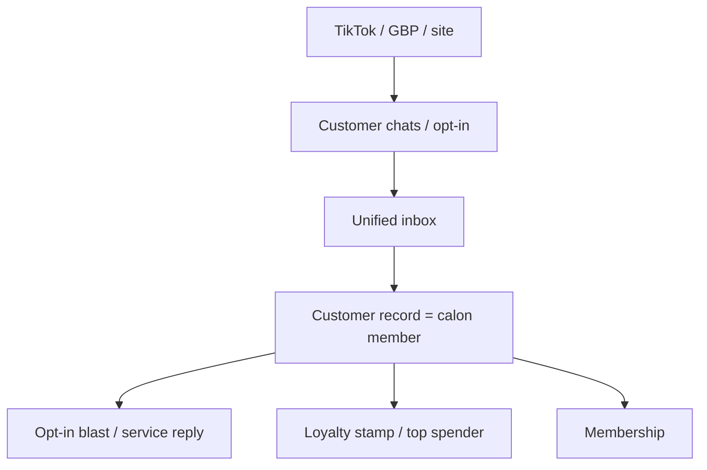

# AtlasNow — 12-month Direction PRD

> [!info] How to read this
> This is the **forward roadmap**. It does **not** replace [[AtlasNow-PRD]] (operational MVP/GBP/GSC/reviews) or [[AtlasNow-Tenancy-Decision]].
> Product language remains English. Merchant UI can be ID.

> [!success] Locked 2026-08-24 (founder chat)
> **Wave A = CRM Inbox first.** One inbox: WhatsApp now, Instagram/Facebook later. Blast **only** to people who already chatted / opted in. A Customer is a **calon member**. Loyalty is built later **from that same dataset**.

> [!success] Locked 2026-08-25 (founder chat)
> **1 nomor HQ per merek = WhatsApp Cloud API resmi** — blast + loyalty + inbox HQ.
> **Nomor cabang = monitor only** (analisa / reporting). Atlas **tidak membalas** dari nomor cabang. Lihat [[AtlasNow-WhatsApp-Decision]].
>
> **Loyalty = 2 program terpisah** (merek pilih nyala mana): stamp (1 struk ≥ min belanja = 1 stamp; Redeem sekali; hangus lifetime atau 1/2 tahun) dan top spender bulanan (cabang atau seluruh merek; Redeem lalu kosong). Lihat [[AtlasNow-Loyalty-Decision]].

> [!success] Locked 2026-08-26 (founder chat)
> **Future: data per agency / brand / client becomes a branded mobile app.** **Icon + app name = merk.** Everything else (members, stamps, chats, locations) = **AtlasNow data**. Staff and members must **not** feel they are “using AtlasNow.” Not Wave A. See §6.

> [!success] Locked 2026-08-27 (founder chat)
> Public story: **multi-location operations**, mechanism **inbox + membership CRM**. Buyer = owner/ops of **multiple outlets**, any industry. Parent tenant in speech = **Group**, not agency, not multitenant. Homepage GBP hero is retired. See [[AtlasNow-PRD]] §0.0 and [[AtlasNow-Tenancy-Decision]].

> [!success] Locked 2026-08-28 (founder chat)
> **Struk: satu kolom nomor** (transaksi / struk / invoice). **Foto wajib.** Default **auto-Approve** only if foto MATCH nomor+Rp, member ada, trx unik, tembus min. Buram/beda → HQ. Mode merek “Kantor cek semua”. Kasir pintu utama; tamu unggah boleh (kartu/WA HQ) syarat sama. POS API signed = gelombang belakangan. Spec: AtlasNow `docs/superpowers/specs/2026-08-28-receipt-photo-auto-approve-design.md`. Not built. See [[AtlasNow-Loyalty-Decision]].

## 1. Product loop (next 12 months)

Demand is captured **where the human already talked to the store**. Marketing channels (TikTok, GBP, ads, website) exist to **create that first chat**, not to dump cold phone lists into WhatsApp.

## 2. Wave A — Inbox CRM (now)

### 2.1 What ships

| Piece | Rule |
|---|---|
| HQ number | **1 per brand. Official Cloud API.** Send + receive. Blast + loyalty live here. |
| Inbox | HQ threads are actionable (reply / loyalty). Branch threads are **read-only** in Atlas. |
| Customer / member | Created from **HQ inbound or HQ opt-in**. Branch chats may be stored for analytics only. |
| Blast | Cloud API **templates** to HQ opt-in list only. Never branch phones, never CSV. |
| Cabang WAHA | Monitor / ingest. **No composer, no blast.** Cap 6 live unofficial sessions — do not connect all stores. |
| IG / FB | Later, official Meta Messaging once App Review is Live. |
| Loyalty | **On the same HQ official number** (not a second chat ID). Stamps / top spender after the member record exists. HQ `Status Stamp` reply **wording** is per brand. Settings → Loyalty: pick brand (top right), then tabs **Membership QR / Birthday gift / Stamp card / Top spender**. Stamp tab = one logo + live overlay. |

### 2.2 Opt-in / blast parameters (hard)

Blast, broadcast, and “customer export for outreach” may only use contacts that pass **all** of:

1. **Tenant + location scope** of the logged-in workspace (agency sees only its brands).
2. **Identity came from chat**, not a cold import: today that is `WaContact` created by WAHA ingest (`src/lib/conversations/service.ts` `listCustomers`).
3. **They wrote first (or opted in):** `WaConversation.lastInboundAt IS NOT NULL`, **or** a future `optInAt` from a keyword (`DAFTAR`, `YES`, form, QR). Outbound-only threads are **not** blastable.
4. **Channel window:** HQ Cloud API = 24h session + **approved templates** outside the window. Branch WAHA = observe only (no send). TikTok (if ever) = 48h, user-initiated, **no broadcast API**.
5. **Stop / opt-out:** inbound `STOP` / `UNSUB` removes from blast immediately.

> [!warning] Do not
> - Import phone numbers and blast.
> - Blast every `WaContact` that only has a phone from an outbound session.
> - Use FAILED / disconnected WA sessions as a send path.

Current `listCustomers` already starts from WhatsApp contacts with a phone. Wave A still needs the **inbound / opt-in filter** before any send UI is built.

### 2.3 Customer = calon member

| Field (concept) | Source now | Later |
|---|---|---|
| Phone / LID | WA inbound | IG/FB scoped id |
| Display name | WhatsApp push name | Profile |
| First / last inbound | `WaConversation` | same |
| Location | Branch that received the chat | same |
| Member? | No | Stamp, spend, join date |
| Opt-in | Implied by inbound chat | Explicit keyword / form |

No invented visits, leads, or revenue. Membership is a **state change on this record**, not a second CRM.

## 3. TikTok messaging (honest park)

TikTok is a **demand channel**, not Wave A inbox.

| Path | Can AtlasNow put it in Inbox? | Blast? | Notes |
|---|---|---|---|
| **Click-to-WhatsApp / Messenger ads** (TikTok Instant Messaging Ads, live in ID) | **Yes — this is the Wave A path.** User taps the ad, lands in WA, we already capture the chat. | Only after that inbound. | Best fit for F&B. |
| **TikTok Business Messaging API** (native in-app DM) | Later, **only via official partner / TikTok review**. User must start the chat. 48h window, ~10 consecutive replies, **no business-initiated messages, no broadcasts**. EEA/UK blocked. Open beta. | **No. API forbids it.** | Partners (Infobip, respond.io, Pancake, etc.), not a public “plug in a token” like WA Cloud. |
| **TikTok Shop Customer Service API** | Only Shop buyer chats, partner-gated, not general DMs. | No | Irrelevant until a brand is a TikTok Shop seller we support. |
| **Public TikTok Developer API** (Login / Content Posting / Display) | **No DMs.** Explicitly excluded. | No | Use for posting / analytics later, not inbox. |
| **Unofficial TikTok Chromium / scraper** | **Forbidden.** | No | Same class of risk as WAHA WEBJS, and WEBJS just OOM’d production. |

### 3.1 What we tell merchants

- “TikTok ads and bio should open **WhatsApp**. AtlasNow inbox is that WhatsApp.”
- “We cannot blast TikTok DMs. TikTok does not allow it.”
- Native TikTok inbox is a **later channel in the same CRM**, same opt-in rule, after partner access — not a 2026 Wave A item.

TikTok **Go / homepage / SEO funnel** stays a marketing site project, not inbox.

## 4. Later waves (not started)

Order can slip; **do not skip Wave A opt-in rules**.

| Wave | Theme | Depends on |
|---|---|---|
| **A** | HQ Cloud API inbox + loyalty + opt-in blast; branch observe-only | Cloud API credentials + template approval. WAHA not used to send. |
| **B** | Stamp + monthly top spender; intake = Atlas form, POS (Moka/Majoo/…), OCR assist | HQ members. POS via partnership. OCR never auto-approve. [[AtlasNow-Loyalty-Decision]] |
| **C** | GBP deeper (Basic API Access submitted **2026-08-31**, case **7-1225000041380**, project **386272165216**) | Google allowlist ~7–10 working days |
| **D** | GSC branch pages | Site / outlet URLs |
| **E** | Ads (incl. TikTok click-to-WA) | Inbox + Events |
| **F** | Membership from calon member | Loyalty |
| **G** | Reservation AI | Inbox + location hours |
| **H** | NAS / video store | Separate infra |
| **I** | **White-label mobile** — branded staff app and/or member app per merk (or per agency). Same tenant data. No AtlasNow chrome. | Stable members + loyalty + tenancy. See §6 |

Monetization (per brand, per WA number, feature packs, paid auto-approve upgrade) stays in [[AtlasNow-Monetization-PRD]] — **master for money**, not priced in this doc. If they conflict, Monetization wins until founder edits it. White-label app SKU is parked there too — do not invent a store price here.

## 5. Infra constraint (2026-08-24 incident)

> [!danger] Live cap — see [[AtlasNow-Ops-Alerts]]
> **Maks 6 nomor WhatsApp hidup** di VPS 8 GB. Cabang ke-7 ditolak sampai ada yang Disconnect.
> Setelah QR sukses, Chromium **tetap hidup** (inbox). 31 Connected = OOM. Konek cabang ramai dulu. Nanti: naik mesin / GOWS / Cloud API.

VPS `atlasnow.co` is **2 CPU / 8 GB**. WAHA WEBJS = **one Chromium per linked location**.

On 2026-08-24, **31** `atl_*` webjs sessions spawned ~236 Chrome processes, RAM ~53 MB free, load >200. `POST /api/auth/login` timed out / 502. The login UI showed **Network error** because the 502 HTML was not JSON.

Mitigation live:

- Explicit Connect only (no auto QR). Unscanned QR stops after 2 minutes.
- Hard cap `WAHA_MAX_LIVE_SESSIONS=6`.
- WAHA `mem_limit: 2g`, `WAHA_WORKER_RESTART_SESSIONS=False`.
- Do not add unofficial TikTok/IG browsers on this box.

## 6. White-label mobile (future — locked as direction, not a ship date)

> [!info] Why this is crucial
> Brands do **not** want cashiers, HQ, or members to feel they are on **our** system. They want **Vilo Gelato’s app** (or the agency’s app). AtlasNow / P2P Labs is the builder. The storefront name, icon, splash, and store listing are the merk.

Same **data**, different **face**. Isolation stays [[AtlasNow-Tenancy-Decision]]: one tenant’s members, stamps, chats, and locations never leak into another merk’s app.

> [!success] Shell vs engine (locked 2026-08-26)
> **On the phone:** icon and application name belong to the merk (Vilo Gelato, not AtlasNow).
> **Behind it:** one AtlasNow tenant — members, stamps, top spender, birthday, HQ WhatsApp, locations. No second database “for mobile.”

### 6.1 Three skins, one engine

| App the human opens | Whose name is on the icon | Who uses it | What it shows |
|---|---|---|---|
| **Agency operator** | Agency (optional) | Agency staff running many merks | Portfolio they parent — still not another agency |
| **Brand staff** | The merk | HQ, kasir, PIC cabang | That merk only: tasks, inbox HQ, loyalty desk, members |
| **Brand member** (consumer) | The merk | Pelanggan | Stamp, birthday, rank — **never** AtlasNow chrome, never other merks |

Today’s web (`atlasnow.co`) is the **workshop**. The mobile apps are the **storefront**.

[[AtlasNow-PRD]] §14.3 (branch mobile view: tasks, proof, no chart dump) is the first **staff** slice. It is still AtlasNow-branded web until Wave I wraps it in the merk’s shell.

### 6.2 Product rules

- **Shell = merk.** Home-screen **icon** and **app name** are the merk’s. Play/App Store listing too. Not “AtlasNow for Vilo.”
- **Engine = AtlasNow.** Join QR, calon/aktif, stamps, top spender, birthday, HQ WhatsApp, locations — already keyed by `tenantId`. The app is a client of that API, not a second CRM.
- **No AtlasNow wordmark** on the member app. Optional discreet “powered by” only if the merk asks.
- **Agency skin** may white-label for the merks they parent. Super Admin does not put P2P’s face on someone else’s merk.
- **Honesty stays.** The branded app still must not invent visits, leads, or revenue. Calon is not aktif. Export is not a blast list.
- **Opt-in stays.** Birthday WA and blast still follow [[AtlasNow-WhatsApp-Decision]] even inside the merk’s app.

### 6.3 What this is not (yet)

- Not a 2026 Wave A deliverable. No App Store date in sales decks.
- Not a native rewrite of GBP/GSC charts for kasir.
- Not one mega-app with a brand switcher that members can see.
- Not copying member phones into a new database “for mobile.”

### 6.4 Build order (when we start)

1. API + branding pack per tenant (name, icon, colors, splash) — web already has `BrandingConfig`; extend, don’t fork.
2. Staff shell (kasir/HQ) — QR, struk, redeem, member lookup. Highest daily use.
3. Member shell — stamp status, birthday, join. Same phone ID as now.
4. Store submit (TestFlight / Play internal) **per merk**, not one AtlasNow listing that we relabel in the binary only.

Full journey (J0–J5, gates, what not to do): [[AtlasNow-White-Label-Mobile-Journey]].

## 7. Open (not locked)

- Switch WAHA WEBJS → GOWS / WhatsApp Cloud API timing.
- Stamp card reset vs stack after N (default: reset).
- Top spender: top 1 vs top N vs min-spend threshold (brand input).
- POS ingest timing.
- When to apply for TikTok Messaging Partner vs keep click-to-WA forever.
- Per-merk subscription SKUs.
- White-label mobile: staff app first vs member app first; whether agency gets its own store listing.
- When (if ever) a discreet “powered by AtlasNow” is allowed on the member splash.
