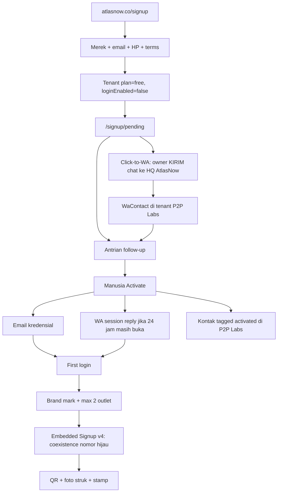

# Free activation + WABA coexistence (locked 2026-09-09)

> [!success] Lock
> Owner merek **sign up di atlasnow.co** (HP wajib). Login **mati** sampai manusia Activate. Free **boleh pasang 1 nomor HQ Cloud + coexistence** (WhatsApp Business App hijau + Cloud, nomor sama) — **Rp 0**. Bukan blast gratis. Nomor toko **tidak bisa** WhatsApp pribadi — harus **ganti ke WhatsApp Business App dulu**, baru disambung. Silver **jangan diutak-atik** di rilis ini.
>
> Money master tetap [[AtlasNow-Monetization-PRD]]. Journey software di sini + [[AtlasNow-PRD]] §6.0.

**Tech Provider (confirmed):** PT Sorak Digital Media Access Verification = **Verified**. Satu app: **AtlasNow** `1551959122621683` (Business: PT Sorak Digital Media). App Review **approved 19 Sep 2026** (`pages_messaging`, `instagram_manage_messages`, `pages_manage_metadata` + WhatsApp renewals). Mode app masih **Unpublished** until founder clicks Live — Embedded Signup ke merek luar butuh Live.

## 1. Who this is for

| In | Out |
|---|
| Owner merek, sudah pakai **WhatsApp Business App** (hijau) di nomor toko | PIC cabang self-serve signup |
| 1 merek, max 2 pintu toko | Nomor toko masih **WhatsApp pribadi** (putih) — **tidak bisa** Cloud/coexistence. Harus **ganti ke WhatsApp Business App dulu** (atau ganti nomor), baru connect |
| Mau nomor **tetap di HP** + inbox Atlas | Toko yang hidup dari **broadcast list** di app (list itu **mati** setelah coexistence) |

Guest/member QR = [[AtlasNow-Loyalty-Decision]], bukan file ini.

## 2. Journey (software)

**Selesai aktivasi (P2P):** login on + email terkirim + baris CRM di P2P Labs.  
**Selesai first value (owner):** 1 outlet + join QR hidup, **atau** nomor hijau nyambung coexistence. Stamp #1 = sukses till, bukan syarat Activate.

## 3. Signup

Wajib: nama merek, email, **nomor HP WhatsApp**, terms. Pintu: brand | grup. `plan=free`. Tidak ada sesi dashboard.

HP = nomor yang P2P bisa WA, **sebaiknya** nomor toko yang akan coexistence. Kalau beda (HP owner vs nomor toko), follow-up catat keduanya; coexistence pakai nomor **app hijau toko**.

**Kode (2026-09-09):** field HP di `/signup` (email + Google/Facebook). Simpan `Tenant.contactPhone` (canonical `62…`). Tampil di follow-up Clients / Agencies.

## 4. Click-to-WA (bukan template dari customer)

Customer **tidak bisa** kirim template Meta ke kita. Template hanya business-initiated.

**Jalur:** di `/signup/pending` tombol **Chat HQ AtlasNow** = `wa.me/<HQ_ATLASNOW>?text=...` (bukan template dari customer — mereka tidak bisa kirim template ke kita). Chat HQ boleh dari **HP mana saja** (pribadi OK).

Prefill (mereka harus **Send**, bukan cuma buka chat):

- ID: `Halo AtlasNow, saya baru daftar [merek]`
- EN: `Hi AtlasNow, I just signed up [brand]`

Kalau mereka **kirim**: jendela service 24 jam ke nomor HQ AtlasNow (Cloud P2P Labs) **buka**. Inbound = `WaContact` tenant **P2P Labs**, bukan member toko mereka. Bukan CTWA ads; ini link situs biasa.

**Activate lalu:**

| Kondisi | Kirim WA “sudah aktif” |
|---|---|
| Mereka sudah chat HQ, masih < 24 jam | **Session message** — tidak perlu template |
| Belum chat, atau 24 jam habis | **Email saja.** Ops: minta tap click-to-WA lagi, baru balas session. |

Jangan blokir Activate karena belum chat. Email selalu jalan.  
**Ops SLA (bukan kode):** Activate dalam 24 jam setelah inbound, supaya WA session keburu.  
Utility template “account activated” = **belakangan**, kalau drop-off click-to-WA tinggi.

## 5. Human Activate → P2P Labs CRM

Hanya orang P2P / Super Admin. Setelah tekan Activate:

1. `loginEnabled=true` + password sekali (atau set yang mereka ketik di signup, kalau email+password).
2. Email: sudah aktif, cara login.
3. WA session jika §4 memungkinkan.
4. Upsert kontak di tenant **P2P Labs**: nama, email, HP, merek, tenantId, status `activated`. Bukan loyalty member.

Pending yang belum Activate: antrian follow-up **saja**. Jangan blast.

## 6. Free includes / excludes

**On**

- 2 outlet toko (bukan HQ), hard-stop
- Brand mark, QR daftar, foto struk, stamp / poin / top spender
- Ultah di kasir; **bukan** WA H-2
- **1 HQ Cloud + coexistence** — pasang Rp 0
- 1.000 service Meta / nomor / bulan — **hadiah Meta, jangan dijual**

**Off**

- Google listings, TikTok GO, blast, kredit (rilis ini)
- WAHA; nomor toko yang masih WhatsApp **pribadi** (harus ganti ke Business App dulu); outlet #3
- Email auto-login (ditolak — gerbang manusia)

## 6a. Dua nomor, dua pekerjaan (jangan campur)

| Pekerjaan | Nomor | WhatsApp pribadi OK? |
|---|---|---|
| Click-to-WA setelah signup (jendela Activate 24 jam) | HP owner chat ke **HQ AtlasNow** (`6285863666290`) | **Ya** — mereka kirim, jendela buka |
| Nanti: HQ Cloud + coexistence | **Nomor toko** | **Tidak.** WhatsApp pribadi tidak bisa. Harus **ganti ke WhatsApp Business App dulu**, baru nomor itu disambung ke Atlas. |

## 7. Coexistence setup (owner + Atlas)

Bukan tempel token. Jalur resmi: **Embedded Signup v4** (v2 mati 15 Okt 2026).

**Owner (HP hijau 2.24.17+)**

1. Login workspace.
2. Connect WhatsApp (tombol ES — **belum ada di kode**).
3. Login Facebook / Meta Business.
4. Nomor **sama** dengan app hijau.
5. Chat resmi Facebook Business di HP → Connect → kode di layar.
6. App refresh: nyambung API. Inbox Atlas + HP 1:1.

**Atlas (setelah PRD)**

- ES v4 pada app `1551959122621683`
- Webhook: `messages` + `history` + `smb_message_echoes` + `smb_app_state_sync` + `account_update`
- Finish coexistence: **jangan** `POST /register` (nomor sudah registered)
- Sync history/kontak dalam **24 jam** atau owner mengulang flow
- Pesan dari HP → echo ke inbox; pesan dari Atlas = tarif Cloud

**Jangan**

- Cloud + WAHA nomor sama
- Cloud + WA putih
- Uninstall app hijau; idle primary ~14 hari → Meta putus
- Janji centang biru, Calling API, grup/status/katalog di inbox
- Latih tempel token sebagai coexistence

Broadcast list di app **disabled** setelah onboard — tulis di training + onboarding copy.

## 8. Money (this file does not invent packs)

- Pasang WABA + coexistence = **Rp 0** pada Free.
- Blast / template = kredit — **belum** di rilis ini.
- Setelah 1.000 service: Meta tagih WABA. Tanpa payment method, **kirim dari Atlas gagal**; HP app tetap hidup.
- Payment gateway SaaS AtlasNow + top-up kredit Meta = **[[AtlasNow-Monetization-PRD]] follow-up**, bukan lock hari ini.
- `/pricing` Free card: hook tetap QR/stamp/foto struk. **Kecil:** *PT Sorak Digital Media is a Meta Tech Provider.* Bukan hero homepage. Bukan logo Meta Partner.
- Silver public price **parked** (jangan rewrite paket di rilis ini).

## 9. Training

Modul coexistence di `/deck_train` **setelah** Connect bisa di-demo. Isi: app hijau vs putih, jangan uninstall, Facebook + HP Connect, 14 hari, broadcast list mati, 1.000 Meta, klik-to-WA ke HQ AtlasNow di pending.

## 10. Not this release

- Kode ES v4 / webhook coexistence
- Pack IDR, Creem, debit kredit
- Utility template Activate
- Rewrite Silver/Gold
- Publish Meta app (App Review done 19 Sep 2026 — Live is founder click, still Unpublished in screenshot)
