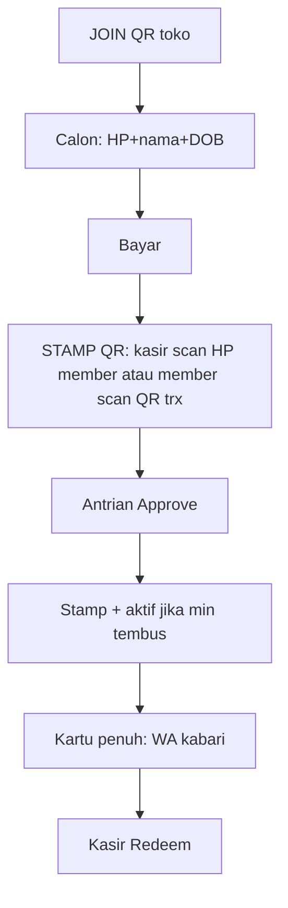

# QR stamp — logic vs what is live (not deployed)

> [!success] Locked 2026-08-26 (founder chat)
> **Customer / membership first. Then stamp QR.** We collect data (HP, nama, DOB, email) before anyone gets a stamp card QR. Stamp QR is the **member’s** QR (kasir scans it) — combination of live AtlasNow join + digital stamp card. Not a table sticker that punches stamps. **Not shipped.**

> [!success] Locked 2026-08-26 — two doors at the till
> Kasir tanya punya member? **Belum** → JOIN QR (daftar). **Sudah** → cek HP di database dulu. Ketemu baru scan **QR stamp member** (`/card/{token}`) atau ketik struk. Stamp tetap setelah Approve. Poster meja = daftar, never stamp.

> [!success] v1 locked 2026-08-26 (founder chat)
> Member tunjuk kartu stamp **via chat nomor HQ** (customer-initiated → jendela 24 jam, bukan template marketing). Kasir tetap bisa **ketik HP** di Loyalty. QR stamp di HP (Path B) belakangan. JOIN poster tetap daftar-only.

> [!info] Competitor pitch we are answering
> Counter QR → stamp auto → dashboard visits → reward auto at goal.
> Member phone shows a stamp card + QR “scan to collect.”
> AtlasNow cannot copy “auto” without POS or we become a stamp farm.

## 1. Two different QRs (do not mix)

| QR | Who scans | Job | Live today? |
|---|---|---|---|
| **JOIN** | Pelanggan scan QR toko (kasir / meja / pintu) | Daftar: HP, nama, DOB, **email wajib**. Logo merek di atas form | **Ya** — `/join/{key}` |
| **STAMP (v1 card)** | Member chat HQ `Status Stamp` / buka `/card` | Lihat count. HQ sends **kartu JPEG** (logo merek + `{count}/{goal}`) + caption. Copy di Settings → Loyalty → Stamp card | **Ya** |
| **STAMP (Path B)** | Kasir **cek HP dulu**. Ketemu baru scan QR stamp di HP member | Isi HP dari QR, kasir isi trx | **Ya** — Loyalty → Cek member |

Static sticker on the counter is **JOIN**, not stamp. A poster anyone can scan must never add a stamp.

## 2. Simulate competitor 4 steps on AtlasNow now

| Their copy | If we did it naively | Honest AtlasNow (existing locks) |
|---|---|---|
| 1. QR on counter, 3 seconds after order | Scan poster = stamp | Scan poster = **daftar** (calon). Stamp only after a **struk** with a valid member number |
| 2. Stamp recorded automatically | Scan = 1 stamp, no receipt | **No paper card.** Stamp is digital **after Approve** (POS later may skip the queue). `trx_id` unique, 1 struk = 1 stamp |
| 3. See who’s coming back, visit counts | Invent visits | **Stamp count** = qualifying receipts. Top spender = ranking with amounts. No fake visits. Calon ≠ datang |
| 4. Reward at goal (donut is only a sample) | App invents a free donut | **Merchant sets the gift** (stamp tiers: kopi, tumbler, voucher…). Goal hit → WA “bisa ditukar” + desk **canRedeem**. **Kasir Redeem**. Not a fixed donut |

## 3. Locked stamp-QR = membership first, then **our** member QR

Keep everything live: daftar dulu → struk dengan no. member sah → min belanja merek → Approve → stamp → Redeem di kasir.

Replace only **how the HP gets onto the struk** (ketik → scan). **Path B locked.** Path C (member scan trx QR) is extra later, not required.

Kombinasi:

| Sudah ada (workshop) | Ditambah (storefront kartu) |
|---|---|
| JOIN QR toko → data customer | Setelah JOIN, member **punya QR stamp sendiri** |
| Calon sampai struk Approve | Kartu 0/N + QR boleh ditunjuk kasir untuk struk pertama |
| Kasir ketik HP + trx | Kasir **scan QR member** + trx |
| Antrian Approve, tiers, Redeem | Sama. Tidak auto-donat |

Tanpa baris Customers / LoyaltyMember → **tidak ada QR stamp.** Poster toko tetap JOIN.

### Path B (locked) — kasir scan QR member

Matches the phone mockup (card 6/10 + QR on the member’s screen).

1. Pelanggan sudah JOIN (calon or aktif).
2. Bayar di kasir.
3. Pelanggan buka kartu (nanti app merek; sementara: halaman status / `Status Stamp` WA / print-once QR from join success).
4. Kasir **scan QR member** → Atlas isi HP. Kasir isi **no. trx** (+ nominal). Bukan ketik HP.
5. Antrian Approve seperti sekarang.
6. Lolos min → +1 stamp. Kartu penuh → notify + tombol Redeem.

QR member = signed token (`tenantId` + phone + short expiry). Bukan nomor HP plain di QR.

### Path C — member scan QR struk (sekali pakai)

Closer to “scan after ordering.”

1. Kasir setelah bayar tekan “QR stamp” di desk → QR **sekali pakai** terikat `trx_id` + outlet + amount.
2. Pelanggan scan.
3. Sudah member → intake masuk antrian atas nama HP itu.
4. Belum member → form JOIN dulu, lalu token struk **nempel** ke HP baru (calon). Tetap **bukan** stamp sampai Approve. Form-first tetap: token tanpa daftar tidak jadi stamp.

**Jangan** Path A: satu QR stiker abadi di meja yang tiap scan = stamp.

## 4. Member screen (mockup → our rules)

What the phone may show **after** we have an API (web page now, branded app later):

| UI | Rule |
|---|---|
| Business name / icon | Merk, not AtlasNow ([[AtlasNow-White-Label-Mobile-Journey]]) |
| 6 / 10 stamps | `memberStampStatus` — real count, not decoration |
| Next reward | Next unclaimed tier (5 kopi, 10 tumbler) |
| QR “collect stamp” | **Member QR** for kasir (path B), or unused until kasir opens checkout QR (path C) |
| Buy 10 get 1 free | Copy from stamp tiers, not a hard-coded 10 |

Calon: kartu 0/N + “belum aktif sampai belanja,” QR member boleh ada supaya kasir bisa scan struk pertama.

Hadiah **tidak** cair di HP. Tunjuk layar, kasir Redeem.

## 5. “Automatic” — kapan boleh dibilang

| When | Stamp without human Approve? |
|---|---|
| Form + foto, OCR **MATCH**, audit off | **Boleh** (amendment 2026-08-28). Buram/beda = antrian |
| Form / WA cabang staf / QR stamp tanpa match | **Tidak.** Antrian admin merek |
| POS signed webhook + unique trx + HP | **Boleh** (already in loyalty decision) |
| Member scanned a table sticker | **Tidak pernah** |

Reward at goal: **copy is merchant-set** (Settings → Loyalty tiers). Notify can be automatic. Hand-over at kasir (**Redeem**). “Free donut” in competitor ads is a sample, not our product.

**Activate:** first **valid** transaction (approved, meets brand min) turns calon → **aktif** and, if stamp is on, that same struk is stamp #1. No stamp and no aktif without that receipt.

## 6. Alur gabungan (existing + proposed)

Yang **sudah live:** JOIN, ketik HP, Approve, stamp, Redeem, tiers, ultah desk.  
Yang **belum:** STAMP QR, kartu di HP, reward auto-give.

## 7. Open (when we build, not whether)

- Kartu HP v1: web `/card/{token}` (workshop) vs app merek (storefront, later).
- Expiry token member QR (rekomendasi: 2–5 menit, refresh).
- Path C (QR trx sekali pakai) — parkir. Bukan pengganti daftar dulu.
