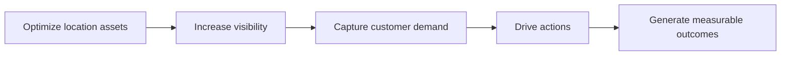
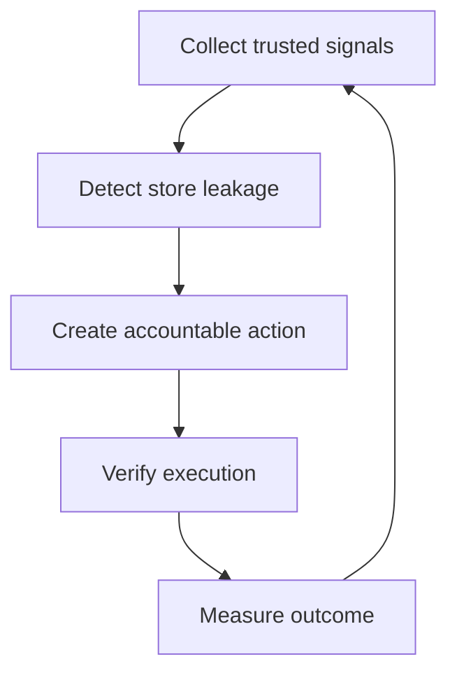
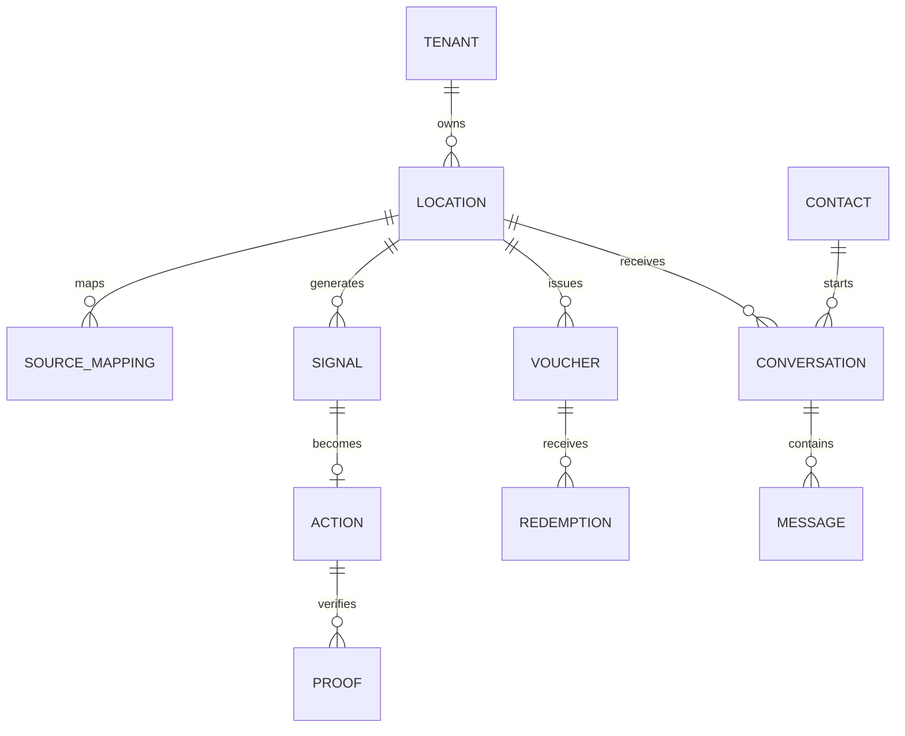

# AtlasNow — Product Requirements Document

> [!success] Product identity
> **P2P Labs** adalah company dan technology builder. **AtlasNow** adalah produk. AtlasNow menunjukkan cabang mana yang kehilangan visibility, lead, atau revenue, lalu mengubah setiap sinyal menjadi tindakan yang memiliki PIC, deadline, dan bukti hasil.

> [!danger] Money — not this file
> Harga, paket, meter, kredit, gateway, invoice, Free vs Brand, “unlimited”: **[[AtlasNow-Monetization-PRD]]** adalah master. PRD ini = apa yang software boleh *ada*. Kalau konflik, Monetization yang menang sampai founder mengubahnya di situ.

## 0.0 Brand & messaging (canonical)

**Product language = English.** Bahasa Indonesia is a UI localization layer, not the source of truth for decks/PRD/sales.

> [!success] Locked 2026-08-27 (founder chat)
> **Category = multi-location operations** (cabang + orang + chat). **How it works = membership + inbox CRM** per merek, many outlets underneath.
> **Buyer of the public site:** executive owner + operations lead who run **multiple outlets** — not digital agencies as the hero, not “already on the map.”
> Industry-agnostic (F&B is a beachhead, not the category): clinic, retail, gym, salon, dealer, education, same loop.
> Human copy for the parent tenant: **Group / Grup**. Never **multitenant** in UI (that is architecture). Never **agency** as the product noun. Holding vs agency-run = same Group type, two business reasons.
> GBP “outlets already on the map” is **retired as hero**. Homepage next: problem slides, then one desk per brand.

### English (primary)

| Layer | Copy |
|---|---|
| **Category** | Multi-location operations |
| **How it works** | Inbox + membership CRM for every brand, across every outlet |
| **Brand tagline** (working) | One desk for every location. |
| **Hero headline** (working) | You already run more than one outlet. The chats, members, and reviews should not live in different places. |
| **Core product promise** | Run membership, inbox, and store ops from one brand desk — as many outlets as you have. |

**Supporting narrative (EN):** Google listings, reviews, and ads still matter. They are not the product. AtlasNow is the desk where HQ chat becomes a member, stamps stay honest, and every outlet is visible to the owner who actually pays.

**Retired public hero (do not use on atlasnow.co):** *Optimize Every Location. Capture More Demand.* / *Your outlets are already on the map. Now make every one perform.* Keep in BrandingConfig until homepage ships; do not treat as canonical.

### Bahasa Indonesia (UI localization)

| Layer | Copy |
|---|---|
| Kategori | Operasi multi-lokasi |
| Cara kerja | Inbox + membership CRM per merek, di semua cabang |
| Tagline (working) | Satu meja untuk setiap lokasi. |
| Hero (working) | Anda sudah punya lebih dari satu outlet. Chat, member, dan review tidak boleh tinggal di aplikasi berbeda. |
| Promise | Jalankan membership, inbox, dan operasi toko dari satu meja merek — sebanyak cabang yang Anda punya. |

### Communication flow



| Step (EN) | Step (ID) | Intent |
|---|---|---|
| Optimize location assets | Optimalkan aset lokasi | GBP/profile completeness, accuracy, posts, reviews ops |
| Increase visibility | Tingkatkan visibility | Impressions, Search vs Maps, portfolio discovery |
| Capture customer demand | Tangkap permintaan pelanggan | Calls, directions (visit intent), website, messages |
| Drive actions | Dorong aksi | Leakage → PIC task → proof → approval |
| Generate measurable outcomes | Hasilkan outcome yang terukur | Claimed/verified redemptions, SLA, honest intent metrics |

> [!note] Language + frontend branding in demo
> Interface language: **EN | ID** cookie switcher (header, login, Settings). Branding stores EN + ID copy in `BrandingConfig`. Default locale = **en**.

## 0. Document control

| Item | Decision |
|---|---|
| Product owner | P2P Labs founder/product lead |
| Primary users | HQ Marketing, HQ Operations, Regional Manager, Branch PIC, P2P Analyst |
| MVP mode | Agency-operated managed service |
| MVP category promise | Local Demand-to-Action Control Tower |
| Long-term category | Multi-Location Revenue Operations |
| Canonical entity | `atlas_location_id` |
| Sample implementation | Vilo Gelato, based on public `/outlets` page only |
| Core release | Foundation + Control + Convert Lite |
| Beta add-on | WAHA Conversation Observability Bridge |
| Source of truth | This PRD for **what the software may exist**. [[AtlasNow-Monetization-PRD]] is **master for money** (packages, meters, credits, rails, price claims). If they conflict, Monetization wins until founder edits it. Blueprint for business context. |

### 0.1 Release map

| Release | Included | Excluded |
|---|---|---|
| **MVP 1.0** | Location Master, GSC, GBP Performance, Reviews, Posts/Offers, social registry, Ads/voucher registry, leakage queue, action workflow, proof, reporting, data health | POS, native agent inbox, auto-reply, guaranteed revenue attribution |
| **Conversation Beta 1.1** | WAHA session mapping, inbound/outbound capture, conversation boundary, response SLA, taxonomy, contact identity confidence, privacy controls | Guaranteed phone resolution, linked-device staff identity, automated sales claims |
| **Revenue 2.0** | POS/booking/CRM, transaction match, contribution margin, verified attributed revenue | Causal incrementality unless experiment design exists |

## 1. Executive product decision

AtlasNow tidak dibangun sebagai kumpulan dashboard channel. Product loop yang harus selesai adalah:



### 1.1 Non-negotiable principle

> Setiap angka harus menjawab **asalnya apa**, **mewakili apa**, **tidak mewakili apa**, **cabang mana**, **periode dan timezone apa**, serta **terakhir sinkron kapan**.

### 1.2 MVP claim boundary

AtlasNow boleh menyatakan:

- visibility leakage;
- visit, call, website, atau conversation intent;
- customer-experience risk;
- execution completion;
- claimed offer atau verified redemption;
- attributed transaction bila ada transaction ID yang cocok.

AtlasNow tidak boleh menyatakan:

- direction request sebagai store visit;
- call click sebagai answered call atau lead;
- review sebagai transaksi;
- voucher redemption sebagai incremental revenue;
- Maps-only ad placement;
- store-level GSC bila seluruh outlet masih berada pada satu URL;
- customer phone number bila WAHA hanya mengembalikan opaque `@lid`.

## 2. Problem statement

HQ bisnis multi-cabang memiliki data terpisah di GBP, GSC, Ads, akun sosial, WhatsApp, dan spreadsheet operasional. Data ini belum menjawab:

1. Cabang mana yang perlu tindakan sekarang?
2. Apa evidence dan diagnosis-nya?
3. Siapa PIC dan kapan harus selesai?
4. Bukti apa yang cukup?
5. Apakah signal atau outcome membaik sesudah tindakan?

### 2.1 Sample problem: Vilo Gelato

Halaman publik [Vilo Gelato Outlets](https://vilogelato.com/outlets) menyebut 36+ cabang, tetapi seluruh outlet ditampilkan pada satu URL. Dampaknya:

- GSC hanya dapat mengukur `/outlets` sebagai satu page entity;
- CTA dan voucher web tidak dapat diatribusikan secara natural ke cabang;
- store slug, GBP location, Ads asset, WhatsApp number, dan akun sosial perlu disatukan oleh `atlas_location_id`;
- unique branch landing page menjadi Foundation prerequisite untuk store-level web search analytics.

Implementasi sample bersifat ilustratif dan tidak mengasumsikan akses atau otorisasi dari Vilo Gelato.

## 3. Goals, non-goals, and success

### 3.1 Product goals

| ID | Goal |
|---|---|
| G-01 | Membuat satu Location Graph yang menyatukan semua source per cabang |
| G-02 | Menyajikan GBP metrics secara presisi dan dapat direkonsiliasi ke enum API |
| G-03 | Mendeteksi leakage yang actionable, bukan sekadar perubahan chart |
| G-04 | Mengubah leakage menjadi action dengan owner, deadline, approval, dan proof |
| G-05 | Menguji bridge ke transaksi melalui voucher GBP/Ads |
| G-06 | Menyediakan observability WhatsApp HQ/cabang tanpa mengarang identitas atau hasil |
| G-07 | Menjaga operasi sesuai authorization, privacy, dan GBP API policy |

### 3.2 Non-goals MVP

- Membuat POS atau CRM baru.
- Menjamin kenaikan revenue atau ranking Maps.
- Menyediakan local rank grid kompetitor dari GBP API.
- Membuat akun sosial baru untuk seluruh cabang.
- Auto-reply review, auto-publish post, atau auto-edit GBP tanpa approval spesifik.
- Menjadi WhatsApp helpdesk lengkap pada Conversation Beta.
- Menentukan staff responder jika pesan dikirim melalui native linked device.
- Menyimpan raw GBP data selamanya.
- Menjalankan cross-client benchmark dari raw GBP content tanpa policy clearance.

### 3.3 MVP success metrics

| Metric | Target |
|---|---:|
| Active location mapped ke satu `atlas_location_id` | ≥95% |
| Scheduled sync sukses tanpa unresolved error | ≥90% |
| KPI card dengan complete Metric Data Contract | 100% |
| High-priority signal ditriage | ≥90% dalam 2 hari kerja |
| Accepted action memiliki owner dan deadline | 100% |
| Completed action memiliki valid proof | ≥70% |
| Minimum verified redemption bridge | 1 campaign end-to-end |
| Client dapat mengidentifikasi bottom store dan next action | Pass usability test |

## 4. Personas and permissions

### 4.1 Personas

| Persona | Primary job | Default scope |
|---|---|---|
| P2P Super Admin | Platform: agencies, standalone brands, access, policy, incidents. Second hat: operate P2P’s own brands. May enter any agency workspace. | Platform directory **or** one agency at a time (switcher). Not “all brands in one bag”. |
| Agency admin | Register and run **that** agency’s brands only | Brands where this agency is parent |
| P2P Analyst | Investigate leakage, draft recommendation, validate proof | Assigned brands **inside one agency** (not other agencies) |
| Standalone brand admin | Run one merk; may apply to become an agency | That brand only |
| HQ Marketing | Profile, content, campaign, voucher, portfolio visibility | Brand-wide |
| HQ Operations | Branch execution, root cause, escalation | Brand-wide |
| Regional Manager | Prioritize and chase assigned branches | Region |
| Branch PIC | Complete tasks and submit proof | Own location |
| Executive Viewer | Portfolio outcomes and risk | Read-only brand-wide |

### 4.2 Permission matrix

| Capability | P2P Admin | P2P Analyst | HQ Mktg | HQ Ops | Region | Branch | Viewer |
|---|:---:|:---:|:---:|:---:|:---:|:---:|:---:|
| Configure connector | ✓ | — | Request | — | — | — | — |
| View portfolio metrics | ✓ | ✓ | ✓ | ✓ | Region | Own | ✓ |
| Read raw review/chat content | Policy | Policy | Policy | Policy | Optional | Own | — |
| Draft post/review reply | ✓ | ✓ | ✓ | — | — | — | — |
| Approve public write | Policy | — | ✓ | Optional | — | — | — |
| Create/assign action | ✓ | ✓ | ✓ | ✓ | Region | — | — |
| Complete action | ✓ | ✓ | ✓ | ✓ | ✓ | Own | — |
| Export PII | Restricted | — | Restricted | — | — | — | — |

`Policy` berarti tenant-level permission, least privilege, recorded purpose, dan audit log.

The matrix above is **inside a brand** (and P2P Analyst on brands they may access). Platform vs agency vs standalone isolation is §4.3 — Agency 1 must not appear in Agency 2’s matrix at all.

### 4.3 Multi-agency tenancy (v1.2 — locked 2026-08-24)

Canonical decision note: [[AtlasNow-Tenancy-Decision]]. Build spec in repo `docs/superpowers/specs/2026-08-24-multi-agency-tenancy-design.md`.

AtlasNow is not a single operator bag of all clients. It is a **platform of agencies**, plus **standalone brands**.

| Workspace | Who | What they see |
|---|---|---|
| Platform | Super Admin atlasnow.co | All agencies, all standalone brands, signup and upgrade queues |
| Agency | Agency admin / analyst | Only brands parented to that agency |
| Standalone brand | Brand admin | That one merk. No Brands / Follow-up / Pitch |

**Super Admin — one login, hats via switcher:** Platform · P2P agency (existing `p2p-labs`) · any other agency (same screens as that agency’s admin). Super Admin may change that agency’s data while switched in. Super Admin does **not** attach a standalone brand to another agency.

**Signup (public):** two doors — **one brand** or **agency**. Terms required. Login stays **off**. They see “we follow up”, not the dashboard. Platform follow-up: new agency, standalone brand, upgrade application. Agency follow-up: only *their* brands waiting for login.

**Upgrade:** standalone brand **applies**; Super Admin **approves** (a person, until monetization). New agency tenant; the existing brand remains the first merk under it. Locations and chats do not move to a new store record. Rejected = stay standalone.

**Ownership field:** `CLIENT.agencyId` → parent `AGENCY`, or null if standalone. Existing VPS clients backfill to **P2P** (`p2p-labs`). New self-serve after this ships = standalone until upgrade.

**Parked (not this build):**

- Per-agency change log UI and WhatsApp-disconnect (or other system) notifications — next phase after tenancy works.
- Monetization: charge **per brand** and **WhatsApp number**, subscribe **by feature**; paid Group upgrade may auto-approve later. **Master:** [[AtlasNow-Monetization-PRD]] — do not invent prices, meters, or “free APIs” here. No paywall in this release.

## 5. Information architecture

### 5.1 Primary navigation

1. **Control Tower** — stores needing action now.
2. **Leakage Queue** — all detected signals and triage.
3. **Locations** — portfolio table and Location 360.
4. **Reputation** — reviews, themes, SLA, replies.
5. **Posts & Offers** — post calendar, offers, policy/moderation state.
6. **Ads & Vouchers** — asset mapping, campaign series, redemptions.
7. **Conversations** — WAHA beta: contacts, threads, SLA, themes.
8. **Action Center** — tasks, approvals, deadlines, proof, outcomes.
9. **Data Health** — connectors, mappings, freshness, coverage, conflicts.
10. **Reports** — monthly loyalty (stamps, gifts, top regulars; live). Weekly operations and monthly executive review still later.

### 5.2 Control Tower widgets

- Portfolio readiness and source coverage.
- Stores needing action, sorted by priority.
- Visibility leakage.
- Reputation risk.
- Conversion-intent leakage.
- Expired/rejected/missing offers.
- Overdue actions.
- Verified redemptions.
- Conversation SLA risk when WAHA beta enabled.
- Data health blockers.

### 5.3 Location 360 tabs

| Tab | Content |
|---|---|
| Overview | Location identity, readiness, current risks, open actions |
| Google visibility | GBP impressions, GSC page/query signals, search keywords |
| Customer action | Calls, directions, website, conversations, bookings, orders |
| Reputation | Rating, reviews, themes, reply SLA, unresolved issues |
| Content | Posts, offers, moderation, freshness, insight |
| Ads & voucher | Location asset, campaign, code, claim/redeem |
| Conversation | WAHA contacts, topics, response SLA, unresolved demand |
| Timeline | Store events, signals, actions, proof, outcomes |
| Data contract | IDs, source mapping, sync, caveats, audit |

## 6. Core user journeys

### 6.1 Onboard a brand and locations

0. Public signup is either a **standalone brand** or an **agency** (both wait for Super Admin). An agency, once live, adds brands underneath. P2P-operated brands stay under the P2P agency. See §4.3.
1. P2P Admin or the owning agency creates / activates the brand tenant and records legal/business authorization.
2. Admin connects Google OAuth and validates accessible accounts.
3. AtlasNow lists authorized GBP locations.
4. Admin imports client store codes and maps each profile to `atlas_location_id`.
5. Admin maps GSC page patterns, Ads assets, social accounts, WhatsApp sessions, and redemption IDs.
6. AtlasNow flags duplicates, missing IDs, unauthorized records, and ambiguous mappings.
7. Analyst reviews and publishes a Data Readiness report.

**Completion condition:** every active location is `READY`, `PARTIAL`, or `BLOCKED` with a reason.

### 6.2 Investigate leakage

1. User opens a high-priority store signal.
2. AtlasNow displays metric definition, period, comparison, source, coverage, and freshness.
3. User compares location with its peer group and Store Event Log.
4. User accepts diagnosis, edits it, marks false positive, or requests more evidence.
5. Accepted diagnosis becomes an action draft.

### 6.3 Complete an action

1. Action receives owner, deadline, proof requirement, and measurement window.
2. Branch PIC receives only actionable instructions.
3. PIC completes the work and submits proof.
4. AtlasNow validates proof automatically where API-verifiable; otherwise analyst reviews it.
5. After the measurement window, AtlasNow records outcome as improved, unchanged, declined, or inconclusive.

### 6.4 Publish a GBP Offer

1. Marketing selects locations, campaign, period, and terms.
2. AtlasNow generates unique GBP codes by location and validates conflicts.
3. User previews exact public content.
4. Authorized approver gives explicit approval.
5. P2P operator/system publishes within permitted operating mode and records audit evidence.
6. AtlasNow monitors lifecycle, moderation, views/CTA action when available, and redemption import.

### 6.5 Monitor WhatsApp demand

1. Admin maps each WAHA session to `HQ` or one `atlas_location_id`.
2. Webhook receives inbound and outbound message events.
3. AtlasNow resolves contact identity where possible and records identity confidence.
4. Messages separated by 24 hours of inactivity become a new conversation.
5. Classifier assigns topic, intent, sentiment, urgency, and requested location.
6. SLA job identifies unanswered or late conversations.
7. Analyst sees aggregate themes; raw content remains access-controlled.

## 7. Functional requirements

### 7.1 Location Master and onboarding

| ID | Requirement | Priority | Acceptance criteria |
|---|---|---:|---|
| LOC-01 | Create immutable `atlas_location_id` | P0 | ID cannot be reused after archive; changes are audited |
| LOC-02 | Import store master via CSV | P0 | Dry-run shows create/update/conflict; invalid rows downloadable |
| LOC-03 | Map external IDs | P0 | GBP, Place, URL, Ads, WAHA, social, redemption IDs can be mapped with confidence |
| LOC-04 | Detect duplicate mapping | P0 | One external location cannot map silently to two active internal locations |
| LOC-05 | Store peer-group attributes | P1 | Format, city tier, age band, catchment, operating hours and capacity are filterable |
| LOC-06 | Store Event Log | P1 | Renovation, closure, stockout, holiday, local event and campaign period appear in timeline |
| LOC-07 | Readiness state | P0 | `READY`, `PARTIAL`, `BLOCKED`; each non-ready source has actionable reason |

### 7.2 Google Search Console

| ID | Requirement | Priority | Acceptance criteria |
|---|---|---:|---|
| GSC-01 | Connect authorized GSC property | P0 | Property, permission, last successful sync and error state visible |
| GSC-02 | Map branch page pattern | P0 | One unique page or regex maps to one location; collision blocks store-level reporting |
| GSC-03 | Pull Search Analytics | P0 | Date, page, query, device, country and search appearance supported within API limits |
| GSC-04 | Honest aggregate fallback | P0 | If only `/outlets` exists, UI says `Portfolio page only`; no store ranking is shown |
| GSC-05 | Track indexation readiness | P1 | Sitemap/URL status and branch page availability recorded as foundation checks |
| GSC-06 | Data completeness caveat | P0 | UI states that API rows may be incomplete/anonymized; no fabricated totals |

### 7.3 Social account capture

| ID | Requirement | Priority | Acceptance criteria |
|---|---|---:|---|
| SOC-01 | Registry for existing accounts | P0 | Handle, URL, platform, scope, owner, location, authorization and status captured |
| SOC-02 | HQ/region/location scope | P0 | Every account has one scope or `UNKNOWN`; conflicts enter review queue |
| SOC-03 | Authorized metric connector | P1 | Metrics shown only from authorized API; manual entries carry `MANUAL` source label |
| SOC-04 | Missing account behavior | P0 | Missing branch account is `NOT_PRESENT`, not an error and not a forced setup task |
| SOC-05 | Content freshness signal | P1 | Last-post date can create a signal only when metric coverage is known |

### 7.4 GBP Business Information and health

| ID | Requirement | Priority | Acceptance criteria |
|---|---|---:|---|
| GBP-BI-01 | List accessible locations | P0 | Pagination up to API limit; requested fields controlled by `readMask` |
| GBP-BI-02 | Store profile identity and hours | P0 | Store code, name, category, phone, address, URL, hours, open state and metadata mapped |
| GBP-BI-03 | Validate Voice of Merchant | P1 | Unverified/duplicate/disabled/ownership-conflict state becomes Data Health issue |
| GBP-BI-04 | Diff before write | P0 | Every proposed write shows old/new values and target locations |
| GBP-BI-05 | Explicit approval | P0 | No public edit runs without approved request tied to actor and timestamp |
| GBP-BI-06 | Rate-limit protection | P0 | Queue respects project quota and per-profile edit limits; retries are idempotent |

### 7.5 GBP Performance

| ID | Requirement | Priority | Acceptance criteria |
|---|---|---:|---|
| GBP-PERF-01 | Fetch multiple daily metrics | P0 | Values stored with metric enum, date, location, source and sync run ID |
| GBP-PERF-02 | Preserve metric universe | P0 | Desktop/mobile and Maps/Search cards reconcile to the same selected range |
| GBP-PERF-03 | Monthly search keywords | P1 | Pagination supported; actual value and privacy `threshold` are different states |
| GBP-PERF-04 | Metric Data Contract | P0 | Every KPI exposes source, enum, definition, formula, coverage, timezone, sync, caveat |
| GBP-PERF-05 | Strict human labels | P0 | Calls=`Call-button clicks`; directions=`Direction requests / visit intent` |
| GBP-PERF-06 | Missing vs zero | P0 | No data, privacy threshold, source error and numeric zero render differently |
| GBP-PERF-07 | Comparison | P1 | Previous period and peer comparison use equal-length ranges and display basis |

### 7.6 GBP Reviews

| ID | Requirement | Priority | Acceptance criteria |
|---|---|---:|---|
| REV-01 | Sync reviews | P0 | Pagination, review ID, reviewer, rating, text, timestamps, media and reply captured |
| REV-02 | Portfolio review inbox | P0 | Filter by location, rating, theme, SLA, reply state, moderation and date |
| REV-03 | Review taxonomy | P0 | Multi-label topics with confidence; low-confidence classification enters QA sample |
| REV-04 | Reply workflow | P1 | Draft → approve → publish; max payload validated; public write audited |
| REV-05 | Reply moderation | P1 | `PENDING`, `REJECTED`, `APPROVED` and policy violation shown |
| REV-06 | Pub/Sub update | P1 | New/updated review event queues targeted sync; daily reconciliation catches missed events |
| REV-07 | Service recovery action | P1 | Severe/unresolved review can create action with assigned ops owner |

### 7.7 GBP Posts and Offers

| ID | Requirement | Priority | Acceptance criteria |
|---|---|---:|---|
| POST-01 | List post inventory | P0 | Standard, event, offer, alert, scheduled and recurring types shown with lifecycle |
| POST-02 | Create GBP Offer Post | P0 | Event schedule, code, redemption URL, terms and media validated before preview |
| POST-03 | Unique code generator | P0 | Code unique by source × location × campaign × period; collision impossible |
| POST-04 | Approval and publish | P0 | Exact preview and explicit approval required; write audit stored |
| POST-05 | Post insights | P1 | Search views and CTA actions use permitted request range and batch size |
| POST-06 | Moderation/policy state | P0 | Rejected/expired/deleted/missing post cannot appear as active |
| POST-07 | Offer freshness alert | P1 | Expiring offer generates a signal based on configurable lead time |

### 7.8 Ads and voucher bridge

| ID | Requirement | Priority | Acceptance criteria |
|---|---|---:|---|
| ADS-01 | Map GBP-synced location asset | P0 | Asset set, location group and Atlas location mapping visible |
| ADS-02 | Campaign cluster model | P0 | One campaign can map to multiple locations; store-level outcome comes from code/mapping |
| ADS-03 | Separate Ads code | P0 | Ads code cannot equal GBP organic code for same location/campaign/period |
| ADS-04 | Serving disclaimer | P0 | UI and proposal never state guaranteed Maps-only delivery |
| VCH-01 | Voucher registry | P0 | Code, source, location, campaign, validity, terms and status stored |
| VCH-02 | Redemption import | P0 | CSV/manual import has dry-run, duplicate detection, void/refund handling and audit |
| VCH-03 | Evidence label | P0 | Claim, redemption, attributed transaction and estimated incrementality remain distinct |
| VCH-04 | Cashier integrity | P1 | Redemption can record operator and receipt reference; suspicious duplicates flagged |

### 7.9 Leakage, recommendations, and actions

| ID | Requirement | Priority | Acceptance criteria |
|---|---|---:|---|
| ACT-01 | Create signal | P0 | Signal contains metric evidence, location, period, severity, confidence and freshness |
| ACT-02 | Suppress invalid recommendation | P0 | `BLOCKED` data, stale source or low mapping confidence cannot auto-create action |
| ACT-03 | Triage signal | P0 | Accept diagnosis, edit, false positive, snooze or request evidence; actor/reason logged |
| ACT-04 | Create accountable action | P0 | Owner, deadline, required proof and expected outcome are mandatory |
| ACT-05 | Approval workflow | P0 | Actions affecting public content/budget require configured approver |
| ACT-06 | Proof validation | P0 | API state preferred; manual file carries timestamp, submitter and reviewer |
| ACT-07 | Measurement window | P0 | Outcome evaluation waits for configured period and records comparison basis |
| ACT-08 | Outcome state | P0 | `IMPROVED`, `UNCHANGED`, `DECLINED`, `INCONCLUSIVE`, `NOT_MEASURABLE` |
| ACT-09 | Audit timeline | P0 | Signal → decision → assignment → proof → outcome visible chronologically |

### 7.10 WAHA Conversation Beta

| ID | Requirement | Priority | Acceptance criteria |
|---|---|---:|---|
| WAHA-01 | Map one session to account scope | P0 Beta | Session belongs to one tenant and `HQ` or one location; ambiguous session disabled |
| WAHA-02 | Receive `message` and `message.any` | P0 Beta | Webhook deduplicates message ID and preserves direction/timestamp/session |
| WAHA-03 | Contact identity confidence | P0 Beta | `PHONE_VERIFIED`, `LID_RESOLVED`, `OPAQUE_LID`, `UNKNOWN`; UI never invents phone |
| WAHA-04 | Conversation segmentation | P0 Beta | New conversation starts after 24h inactivity; rule configurable per tenant |
| WAHA-05 | Response SLA | P0 Beta | First human outbound after first inbound is measured; bot/system messages excluded if tagged |
| WAHA-06 | Conversation taxonomy | P0 Beta | Intent, topic, sentiment, urgency, requested location, and outcome support confidence |
| WAHA-07 | Who contacted which number | P0 Beta | Contact identifier + destination session + HQ/location scope + first/last seen queryable |
| WAHA-08 | Staff identity limitation | P0 Beta | Native linked-device reply shows `Account responder`; named agent only if AtlasNow inbox sends it |
| WAHA-09 | Raw-content access | P0 Beta | Tenant policy, purpose, role, audit and retention enforced before content display |
| WAHA-10 | Session health | P0 Beta | Start/scan/working/failed/stopped states monitored; disconnected number creates incident |
| WAHA-11 | Security boundary | P0 Beta | WAHA is private-network only, API keys scoped, webhook authenticated, secrets rotated |
| WAHA-12 | Kill switch | P0 Beta | Admin can stop ingestion and purge scheduled raw content per tenant/number |
| WAHA-13 | Export aggregate insight | P1 Beta | Aggregates omit raw phone/text by default and state classification coverage |
| WAHA-14 | Official migration mapping | P1 Beta | Session/account/location mapping is connector-neutral for future Cloud API swap |

### 7.11 Reports and alerts

| ID | Requirement | Priority | Acceptance criteria |
|---|---|---:|---|
| REP-01 | Weekly action report | P0 | New signals, completed/overdue tasks, proof status, blockers and next actions |
| REP-02 | Monthly portfolio review | P0 | Visibility, intent, reputation, offers, redemption, execution and data health |
| REP-03 | Evidence language | P0 | Report preserves platform-reported, verified, attributed and estimated labels |
| REP-04 | Alert routing | P1 | Alerts route by location/region and severity; duplicate alert cooldown supported |
| REP-05 | Metric drill-down | P0 | User can trace any reported number to its Metric Data Contract and source run |
| REP-06 | Monthly loyalty recap | P0 | Reports shows this month’s loyalty: members returned, stamps/receipts, gifts redeemed, top regular/spender. Platform name AtlasNow. No invented visits. Numbers from LoyaltyStamp / LoyaltyRedemption / LoyaltyMember. |

## 8. Source and API contracts

### 8.1 GBP API matrix

| Capability | API/resource | Data/operation | Cadence | Product rule |
|---|---|---|---|---|
| Location list | Business Information `accounts.locations.list` | Location fields via `readMask` | Daily + on demand | Max 100/page; authorized accounts only |
| Location health | Business Information + Verifications | Open state, metadata, Voice of Merchant | Daily | Health issue, not performance metric |
| Daily performance | Performance `locations.fetchMultiDailyMetricsTimeSeries` | Daily metric series | Daily | Preserve enum and date grain |
| Search keywords | Performance monthly impressions list | Keyword + value or threshold | Monthly | Never convert threshold into exact count |
| Reviews | GBP v4 `accounts.locations.reviews` | List/get reviews | Event + daily reconciliation | Verified locations; max 50/page |
| Review reply | GBP v4 review reply methods | Update/delete owner reply | User-approved | Moderation and policy violation shown |
| Posts | GBP v4 `accounts.locations.localPosts` | Create/get/list/patch/delete | Daily + user action | Public writes need preview/approval |
| Post insights | Local Posts `reportInsights` | Search views and CTA actions | Daily/weekly | Max 100 post names; time range ≤18 months |
| Notifications | Notifications `NotificationSetting` | Pub/Sub event subscription | Real-time + reconcile | Q&A excluded because API discontinued |

### 8.2 GBP Performance metric dictionary

| API enum | AtlasNow UI label | Interpretation | Forbidden interpretation |
|---|---|---|---|
| `BUSINESS_IMPRESSIONS_DESKTOP_MAPS` | Desktop Maps impressions | Profile impression on Maps desktop | Unique people or visits |
| `BUSINESS_IMPRESSIONS_DESKTOP_SEARCH` | Desktop Search impressions | Profile impression on Search desktop | Store traffic |
| `BUSINESS_IMPRESSIONS_MOBILE_MAPS` | Mobile Maps impressions | Profile impression on Maps mobile | Unique people or visits |
| `BUSINESS_IMPRESSIONS_MOBILE_SEARCH` | Mobile Search impressions | Profile impression on Search mobile | Store traffic |
| `BUSINESS_CONVERSATIONS` | GBP conversations started | Platform-reported conversation action | Qualified lead |
| `BUSINESS_DIRECTION_REQUESTS` | Direction requests / visit intent | Request for directions | Store visit |
| `CALL_CLICKS` | Call-button clicks | Click on call action | Answered call or lead |
| `WEBSITE_CLICKS` | Website clicks | Click to website | Form lead or transaction |
| `BUSINESS_BOOKINGS` | GBP bookings | Platform-reported booking | Attended appointment |
| `BUSINESS_FOOD_ORDERS` | GBP food orders | Platform-reported order action | Net revenue without order match |
| `BUSINESS_FOOD_MENU_CLICKS` | Food-menu clicks | Click to menu | Order |

### 8.3 Metric Data Contract schema

```yaml
metric_key: gbp_call_clicks
source_system: GBP_PERFORMANCE
source_metric: CALL_CLICKS
ui_label: Call-button clicks
grain: location_day
timezone: Asia/Jakarta
period_start: 2026-07-01
period_end: 2026-07-31
formula: sum(daily_value)
coverage:
  connected_locations: 34
  expected_locations: 36
freshness:
  last_successful_sync: 2026-08-01T04:12:00+07:00
  status: FRESH
caveat: Platform-reported click intent; not an answered call.
source_run_id: SYNC-GBP-20260801-001
```

### 8.4 GSC contract

- Source: Search Console Search Analytics API.
- Default grain: `date × page`, optionally query/device/country/search appearance.
- Store mapping: exact branch page or controlled URL regex.
- No city dimension; country is not branch mapping.
- UI must disclose filtered/anonymized and row-limit behavior.
- Branch with shared `/outlets` page remains portfolio-only.

### 8.5 Ads contract

- Location assets are synchronized from authorized GBP accounts.
- Asset sets and location groups are mapped to `atlas_location_id` or cluster.
- Google controls eligible serving surfaces; Maps-only placement is not promised.
- Spend/click data is campaign/platform performance; store outcome requires voucher or transaction bridge.

### 8.6 WAHA event contract

```yaml
event_id: provider-message-id
provider: WAHA
session: vilo_jkt_menteng
tenant_id: VILO
atlas_location_id: VILO-JKT-MTG
destination_scope: LOCATION
direction: INBOUND
contact_id: normalized-or-opaque-id
identity_type: PHONE_VERIFIED | LID_RESOLVED | OPAQUE_LID | UNKNOWN
message_type: text | image | audio | video | document | other
message_timestamp: 2026-08-04T12:30:00+07:00
body_ciphertext: encrypted-and-retention-controlled
has_media: false
reply_to_id: null
ingested_at: 2026-08-04T12:30:02+07:00
```

## 9. Data model



### 9.1 Core entities

| Entity | Essential fields |
|---|---|
| `tenant` | `tenant_id`, name, policy profile, timezone, retention, status |
| `location` | `atlas_location_id`, store code, name, geo, peer attributes, operating status |
| `source_mapping` | source, external ID, location, confidence, verified by/at, active |
| `metric_observation` | source metric, location, date, value/threshold, sync run, raw-expiry |
| `review` | provider ID, location, rating, text, reply/moderation, timestamps, raw-expiry |
| `local_post` | provider ID, location, type, schedule, lifecycle, voucher, insight, raw-expiry |
| `signal` | domain, evidence references, severity, confidence, priority, state |
| `action` | diagnosis, instruction, owner, deadline, approval, proof requirement, outcome |
| `proof` | type, submitter, URI/source state, validation, reviewer, timestamp |
| `voucher` | code, source, campaign, location, period, terms, status |
| `redemption` | code, receipt, timestamps, gross/discount/net, void/refund, import run |
| `waha_session` | session ID, account identifier, tenant/location, scope, engine, health |
| `contact` | normalized/opaque ID, identity confidence, masked phone, first/last seen |
| `conversation` | contact, destination, start/end, SLA, taxonomy, outcome, content expiry |
| `message` | provider ID, conversation, direction, timestamps, type, encrypted content, expiry |
| `store_event` | location, event type, period, effect, source, notes |
| `sync_run` | connector, start/end, status, pages, records, error, retry |
| `audit_event` | actor, tenant, object, action, before/after hash, timestamp, purpose |

### 9.2 Location identity invariants

1. `atlas_location_id` immutable.
2. External ID history retained even after remap.
3. Only one active mapping per source/external ID.
4. Many campaign assets may map to one location; a single GBP location may not map to two active locations.
5. Identity conflict blocks recommendations from affected source.

## 10. Signal and recommendation engine

### 10.1 Priority formula

```text
Priority Score (0–100)
= Severity 30%
+ Estimated business exposure 25%
+ Confidence 20%
+ Urgency 15%
+ Actionability 10%
```

Business exposure in MVP is an indexed score. IDR impact is enabled only after voucher/POS baseline and attribution rules exist.

### 10.2 Initial deterministic rules

| Rule | Trigger | Guardrail | Suggested action |
|---|---|---|---|
| Profile visibility drop | 28-day Maps/Search impressions decline vs equal prior period and peers | Suppress during closure/event or low coverage | Audit listing health, hours, category and demand context |
| Weak intent rate | Impressions stable/up; total customer-action rate falls | Minimum impression volume | Improve profile content, offer and destination |
| Review response leak | Negative review unreplied beyond SLA | Exclude deleted/rejected states | Draft reply + service recovery task |
| Recurring experience issue | Same negative theme exceeds baseline | Minimum classified sample/confidence | Create ops corrective action |
| Offer coverage gap | Target store has no live offer during campaign | Exclude non-participating store | Create/publish location offer |
| Redemption leak | Offer exposure exists; no redemption | Require cashier data completeness | Validate offer, code, staff SOP and demand fit |
| Conversation response leak | Inbound conversation unanswered beyond SLA | WAHA healthy; exclude spam/system | Route/escalate staffing action |
| Data health block | Sync/mapping stale or conflicting | Always higher priority than optimization | Repair source/mapping |

### 10.3 AI usage

AI may:

- classify review/chat themes, sentiment, urgency, and intent;
- draft diagnosis, action, review reply, or post copy;
- summarize evidence and recurring patterns;
- propose peer comparisons and measurement plans.

AI may not:

- publish public content or edit GBP without approval;
- infer a phone number from opaque identity;
- label revenue as verified without transaction evidence;
- override raw metric definitions;
- silently merge locations, contacts, or conversations;
- expose raw conversation text to unauthorized users.

Every AI output stores model/version, prompt/template version, confidence, input references, reviewer, and final edit delta.

## 11. Voucher and revenue evidence model

### 11.1 Code convention

```text
{SOURCE}-{LOCATION}-{CAMPAIGN}-{PERIOD}-{VARIANT}

GBP-JKTMTG-GELATO-AUG26-A
ADS-JKTMTG-GELATO-AUG26-A
```

### 11.2 Evidence ladder

| State | Required evidence | Allowed claim |
|---|---|---|
| `EXPOSED` | Active offer/post/ad record | Offer available |
| `CLAIMED` | Trackable claim event | Claimed offer |
| `REDEEMED` | Cashier/imported redemption record | Verified redemption |
| `ATTRIBUTED_SALE` | Unique transaction/receipt match | Verified attributed sale |
| `ESTIMATED_INCREMENTAL` | Predefined test/control or causal method | Estimated incremental impact |

### 11.3 Redemption import columns

Required:

- `voucher_code`
- `redeemed_at`
- `atlas_location_id` or mapped store code
- `receipt_id`
- `status`

Recommended:

- gross sales, discount cost, net sales;
- cashier/operator;
- new/existing customer when lawful and available;
- void/refund status and timestamp.

## 12. Conversation analytics specification

### 12.1 Definition of “siapa yang masuk”

AtlasNow reports:

- stable contact ID if available;
- masked phone number only when provider resolves it;
- display name when provider returns it;
- identity confidence;
- first seen, last seen, new/repeat status;
- number/session contacted;
- HQ or branch destination;
- requested outlet, if stated or classified;
- conversation count and aggregate outcome.

AtlasNow does not promise legal identity, demographic profiling, or phone number resolution from `@lid`.

### 12.2 Default intent taxonomy

- Purchase intent.
- Product/menu query.
- Price query.
- Product availability/stock.
- Outlet/address/hours.
- Promotion/voucher.
- Reservation/booking.
- Delivery/order status.
- Complaint/service recovery.
- Partnership/career/vendor.
- Spam/irrelevant.
- Other/unknown.

### 12.3 Conversation boundary and SLA

- Start: first inbound message after no activity for 24 hours.
- End: 24 hours inactivity, manual resolved state, or explicit close event.
- First response: first qualifying human outbound after conversation start.
- Response rate: conversations with qualifying response divided by eligible inbound conversations.
- Unanswered: no qualifying response before tenant SLA.
- Named agent: only available if outbound action passes through an authenticated agent surface; otherwise `ACCOUNT_RESPONDER`.

### 12.4 Content retention defaults

| Data | Default |
|---|---:|
| Raw message body | 30 days |
| Media object | 7 days unless case requires longer |
| Masked identity and message metadata | 12 months, tenant configurable |
| De-identified taxonomy aggregate | 24 months after policy approval |
| Audit log | 24 months minimum |

Client legal/privacy review may shorten these periods. Extending raw-content retention requires documented purpose and approval.

## 13. Sync, freshness, and failure behavior

### 13.1 Default sync schedule

| Source | Default | Reconciliation |
|---|---|---|
| GBP Business Information | Daily 03:00 local | On demand after approved edit |
| GBP Performance | Daily 04:00 local | Re-fetch recent 7 days |
| GBP search keywords | Monthly after source availability | Re-fetch previous 2 months |
| Reviews | Pub/Sub targeted | Full daily reconciliation |
| Posts/Offers | Daily + after write | On-demand state check |
| Post insights | Daily/weekly | Re-fetch active campaign window |
| GSC | Daily | Re-fetch recent 3 days |
| Ads | Daily | Source-window reconciliation |
| Voucher CSV | User-triggered | Import status and duplicate report |
| WAHA | Event-driven | Session health every 1 minute |

### 13.2 Freshness states

| State | Meaning |
|---|---|
| `FRESH` | Within expected source cadence |
| `DELAYED` | Beyond expected cadence but source still connected |
| `STALE` | Unfit for current decision |
| `ERROR` | Sync failed |
| `DISCONNECTED` | Authorization/session unavailable |
| `NOT_APPLICABLE` | Source intentionally not used for location |

Stale/error metrics remain visible historically but cannot generate a fresh recommendation.

### 13.3 Retry and idempotency

- Exponential backoff with jitter for retryable errors.
- Respect `Retry-After` and source quota.
- Upsert using source object ID + date/version.
- Webhook events deduplicated by provider event/message ID.
- Public writes use idempotency record and pre-write diff.
- Poison events enter dead-letter queue with tenant-safe payload reference.

## 14. UX and states

### 14.1 Metric card anatomy

Every card displays:

1. Metric label and value.
2. Location or portfolio scope.
3. Date range and timezone.
4. Comparison basis.
5. Coverage, e.g. `34/36 locations`.
6. Freshness and last sync.
7. Source badge: `GBP`, `GSC`, `ADS`, `WAHA`, `MANUAL`, `ATLAS CALCULATED`.
8. “Why this number?” drawer with exact enum/formula/caveat.

### 14.2 Empty and exceptional states

| State | UI behavior |
|---|---|
| True zero | Show `0` with valid source and coverage |
| No source data | Show `No data`, never `0` |
| Privacy threshold | Show `< threshold` and explanatory tooltip |
| Partial portfolio | Show value plus coverage ratio |
| Mapping conflict | Block store comparison and link to Data Health |
| Disconnected | Preserve last known period with stale banner |
| Policy-restricted | Explain unavailable operation without exposing internal credentials |

### 14.3 Branch mobile view

Branch PIC sees:

- today’s tasks;
- why each task matters;
- deadline and escalation owner;
- exact completion instructions;
- allowed proof method;
- submitted/rejected/approved proof state.

Channel charts are not the default branch view.

### 14.4 White-label mobile (future)

**Direction locked 2026-08-26** in [[AtlasNow-Direction-PRD]] §6. Not in MVP.

Per-tenant data (agency / brand / client) may later ship as a **branded mobile app**: **icon + app name = the merk**; **all records = AtlasNow** (same `tenantId`). Staff and members must not feel they are using P2P’s system. No second member database. Branch mobile view (§14.3) is the staff content; Wave I is the branded shell. Journey: [[AtlasNow-White-Label-Mobile-Journey]].

## 15. Security, privacy, and platform policy

### 15.1 Tenant and data security

- Strict tenant isolation at application and query layer. **Agency isolation is mandatory:** an agency query must not return another agency’s brands or a standalone brand it does not own. Super Admin platform mode is the only listing of all agencies / standalone brands. `isAgencyStaff ⇒ all CLIENT rows` is forbidden after v1.2.
- Encryption in transit and at rest.
- Secrets in managed secret store, never application logs.
- Role- and location-scoped authorization.
- Raw review/chat content excluded from general exports and analytics logs.
- PII masking by default; unmask action requires permission, purpose, and audit.
- Immutable audit trail for writes, approvals, exports, raw-content access, and mapping changes.
- Signed uploads, malware scanning, file type/size limits, and retention on proof attachments.

### 15.2 GBP operating policy requirements

Initial operating mode is **agency-operated managed service**:

1. P2P handles only business profiles explicitly authorized by the client.
2. Client receives visibility into proposed changes and completed writes.
3. Public replies, posts, and profile edits require specific express approval under configured workflow.
4. Access/offboarding request is completed within the policy window; operational target is no more than seven business days.
5. Raw GBP content is cached only as necessary, encrypted, and automatically expires after 29 days.
6. Persistent historical/derived GBP storage and cross-client benchmarking are disabled until written policy clarification approves the design.
7. AtlasNow retains its own operational objects—authorization, mappings, actions, approvals, proof, redemption, and client-supplied outcomes—subject to their own lawful retention.
8. Self-service end-user automation through P2P’s GBP API project is a separate policy/legal release gate.

### 15.3 WAHA operating policy

- WAHA is explicitly labeled an unofficial connector.
- Client accepts number/session reliability risk before enablement.
- Use begins with HQ or 3–5 opted-in branch numbers, not fleet-wide by default.
- WAHA API/dashboard is never public internet-facing.
- Session-scoped read key for ingestion; admin key isolated.
- Version pinned; upgrade happens in staged test.
- Session disconnect/block risk triggers alert and kill switch.
- Data-protection assessment, purpose notice, retention, access roles, and processor agreement completed before raw-content analysis.
- Connector-neutral data model preserves migration path to official WhatsApp Business Platform.

## 16. Non-functional requirements

| ID | Requirement | Target |
|---|---|---|
| NFR-01 | Portfolio page performance | P95 <3 seconds for 200 locations after cache |
| NFR-02 | Location page performance | P95 <2.5 seconds excluding cold source fetch |
| NFR-03 | API availability | 99.5% monthly for MVP, excluding source outage |
| NFR-04 | Event ingestion latency | WAHA P95 <30 seconds while session healthy |
| NFR-05 | Tenant isolation tests | 100% automated authorization cases pass |
| NFR-06 | Audit completeness | 100% public writes, PII views/exports and approvals logged |
| NFR-07 | Recovery point | ≤24h for operational DB; event queue replay where possible |
| NFR-08 | Recovery time | ≤8h MVP critical service restoration |
| NFR-09 | Accessibility | WCAG 2.1 AA for core web flows |
| NFR-10 | Localization | Bahasa Indonesia primary; English-ready labels and UTC storage |
| NFR-11 | Browser support | Latest two versions of Chrome, Edge, Safari |
| NFR-12 | Observability | Structured logs, metrics, traces, sync dashboard, source-safe alerts |

## 17. Analytics instrumentation

### 17.1 Product events

- `tenant_created`
- `location_imported`
- `source_connected`
- `mapping_conflict_detected`
- `metric_contract_opened`
- `signal_created`
- `signal_triaged`
- `action_assigned`
- `proof_submitted`
- `proof_validated`
- `outcome_measured`
- `offer_approved`
- `offer_published`
- `redemption_imported`
- `conversation_sla_breached`
- `raw_content_viewed`
- `report_exported`

Every event includes tenant, user role, object ID, location scope where applicable, timestamp, release version, and privacy-safe metadata.

### 17.2 Internal operating metrics

- Connector success/error rate.
- Source freshness by tenant.
- Unmapped/ambiguous location count.
- Signal precision based on false-positive triage.
- Recommendation acceptance rate.
- Action completion and overdue rate.
- Proof rejection rate.
- Median time signal-to-assignment and assignment-to-proof.
- WAHA duplicate, disconnect, and unresolved identity rate.
- Voucher duplicate/redemption integrity rate.

## 18. QA and release acceptance

### 18.1 Critical test scenarios

| Test | Expected result |
|---|---|
| Same GBP ID mapped to two stores | Second mapping blocked; conflict visible |
| Vilo-style shared `/outlets` URL | Store-level GSC view disabled with explanation |
| GBP daily metric absent | Renders `No data`, not zero |
| Search keyword returns threshold | Renders `< threshold`, never an invented value |
| Performance totals use different universes | UI prevents comparison or explains formula/universe |
| Direction requests card | Label includes visit intent; no “store visits” claim |
| Review reply rejected | Moderation and violation visible; no approved state |
| Offer code collision | Publish blocked before approval |
| Same redemption imported twice | Duplicate rejected/idempotent; import report shows reason |
| Stale source creates signal | Recommendation suppressed as `Measurement blocked` |
| WAHA retries same message event | One stored message only |
| WAHA returns opaque `@lid` | Contact saved without fabricated phone; confidence shown |
| Staff replies from linked phone | Responder shown as account-level, not named agent |
| Unauthorized branch user opens other store | Access denied and audited |
| GBP raw record reaches day 29 | Expiry job removes raw content while allowed operational references remain |
| Approved public write retries | Idempotency prevents duplicate post/reply |

### 18.2 MVP release gates

- P0 acceptance criteria pass.
- No critical tenant-isolation or public-write defect.
- GBP authorization and policy checklist signed for pilot tenant.
- Metric dictionary reviewed by Product, Data, and Client Success.
- Data retention jobs tested.
- Rollback and connector kill switch tested.
- At least five representative locations complete one full signal-to-proof loop.
- Voucher import completes one clean dry-run and one production run.
- Conversation Beta ships only after separate security/privacy readiness review.

## 19. Illustrative Vilo implementation plan

### 19.1 Proposed location URL design

```text
/outlets/{city}/{branch-slug}

/outlets/jakarta/vilo-menteng
/outlets/tangerang/vilo-alam-sutera
```

Each branch page requires:

- unique title, description, address, hours and contact CTA;
- LocalBusiness schema with consistent store code;
- canonical URL and sitemap entry;
- embedded/map link tied to the correct Place/GBP;
- `atlas_location_id`/`store_id` in analytics events;
- branch voucher and WhatsApp click attribution;
- no duplicate thin page created only to manipulate search.

### 19.2 Pilot cohort

- Discover/map all public locations.
- Connect only profiles/accounts with explicit authorization.
- Select 10–20 data-ready locations for active intervention.
- Four-week baseline and eight-week intervention.
- Match test/control by city, format, store age, hours, and historical demand.
- Start WAHA beta with HQ or 3–5 branch numbers after separate approval.

### 19.3 Required outputs

1. Location Graph and mapping exception report.
2. Data Readiness by location/source.
3. GBP Performance, Reviews, and Posts metric contract report.
4. Top 10 actionable leakage cards.
5. At least one approved GBP Offer series.
6. Separate Search Ads voucher series and asset mapping.
7. Redemption import and evidence report.
8. Weekly action sprint with proof.
9. Optional WAHA conversation SLA and theme report.
10. Final outcome report with strict evidence labels.

## 20. Dependencies

- Client authorization and correct GBP manager/account access.
- Google API project approval, OAuth consent, quota, and Pub/Sub.
- Unique client store codes or approved canonical mapping.
- Ability to create unique branch URLs for store-level GSC.
- Ads account linkage and permission to sync location assets.
- Cashier/POS process for voucher redemption capture.
- Authorized social accounts when performance metrics are expected.
- WAHA infrastructure, number owner approval, security boundary, and privacy review.
- Client owner for public post/review reply approvals.

## 21. Risks and product responses

| Risk | Product response |
|---|---|
| GBP API project/access disabled | Policy-first onboarding, explicit authorization, audit, manual fallback plan |
| GBP storage policy limits history | 29-day raw cache; persistent derived analytics behind written clearance |
| Metrics mistaken for revenue | Strict labels and Metric Data Contract |
| Shared web page prevents store mapping | `Portfolio page only` state; Foundation branch URL project |
| Voucher leakage/sharing | Source/location code, receipt match, duplicate checks, test/control |
| Cashier fails to record code | Store compliance metric and SOP; do not report missing data as zero demand |
| WAHA disconnect/block | Optional beta, health monitor, kill switch, official migration path |
| Opaque contact identity | Confidence state; never invent number |
| Staff identity unavailable | Account-level responder; require agent inbox for named attribution |
| AI classification error | Confidence, QA samples, editable taxonomy, human review |
| Unfair branch comparison | Peer groups and Store Event Log |

## 22. Open decisions before build lock

| Decision | Options | Recommended default |
|---|---|---|
| Pilot size | 10 / 20 / all locations | 10–20 active, all mapped |
| Branch page delivery | P2P builds / client builds / spec only | P2P spec + implementation add-on |
| Social connectors | Instagram only / +TikTok / +Facebook | Registry all; authorized Instagram first |
| Voucher intake | Form / CSV / POS field | CSV with cashier POS code if available |
| WAHA first scope | HQ / 3–5 branches / all | HQ + 3–5 opt-in branches |
| Raw WhatsApp retention | 7 / 30 / 90 days | 30 days, shorter if policy requires |
| Public content approver | HQ Marketing / P2P / dual | HQ Marketing explicit approval |
| GBP derived history | Disabled / legal interpretation / Google clarification | Disable until written clarification |

## 23. Definition of done

AtlasNow MVP is done when an authorized multi-location client can:

1. map its branches and see data-health gaps;
2. view GBP/GSC/social/voucher signals with exact source definitions;
3. identify at least one high-priority leakage;
4. assign an action with PIC and deadline;
5. verify execution through API or approved proof;
6. measure the post-action signal or redemption outcome;
7. export a report that does not overclaim visits, leads, sales, or causality.

Conversation Beta is done when HQ can answer, with disclosed confidence:

> Nomor HQ/cabang mana yang menerima inbound demand, siapa contact identifier-nya, apa topik percakapannya, apakah dijawab sesuai SLA, dan apa outcome yang tercatat?

## 24. Primary references

- [Vilo Gelato outlets](https://vilogelato.com/outlets)
- [Google Business Profile API overview](https://developers.google.com/my-business/ref_overview)
- [GBP Business Information locations](https://developers.google.com/my-business/reference/businessinformation/rest/v1/locations)
- [GBP Performance API](https://developers.google.com/my-business/reference/performance/rest)
- [GBP DailyMetric enum](https://developers.google.com/my-business/reference/performance/rest/v1/DailyMetric)
- [GBP monthly search keywords](https://developers.google.com/my-business/reference/performance/rest/v1/locations.searchkeywords.impressions.monthly/list)
- [GBP reviews](https://developers.google.com/my-business/reference/rest/v4/accounts.locations.reviews)
- [GBP local posts](https://developers.google.com/my-business/reference/rest/v4/accounts.locations.localPosts)
- [GBP post insights](https://developers.google.com/my-business/reference/rest/v4/accounts.locations.localPosts/reportInsights)
- [GBP notifications](https://developers.google.com/my-business/reference/notifications/rest/v1/NotificationSetting)
- [GBP API policies](https://developers.google.com/my-business/content/policies)
- [GBP API limits](https://developers.google.com/my-business/content/limits)
- [Search Console Search Analytics API](https://developers.google.com/webmaster-tools/v1/searchanalytics/query)
- [Google Ads location assets](https://developers.google.com/google-ads/api/docs/assets/location-assets)
- [Local search ads on Maps](https://support.google.com/google-ads/answer/7040605?hl=en)
- [WAHA GitHub](https://github.com/devlikeapro/waha)
- [WAHA introduction and disclaimer](https://waha.devlike.pro/docs/overview/introduction/)
- [WAHA receive messages](https://waha.devlike.pro/docs/how-to/receive-messages/)
- [WAHA sessions](https://waha.devlike.pro/docs/how-to/sessions/)
- [WAHA contacts and LIDs](https://waha.devlike.pro/docs/how-to/contacts/)
- [WAHA security](https://waha.devlike.pro/docs/how-to/security/)
