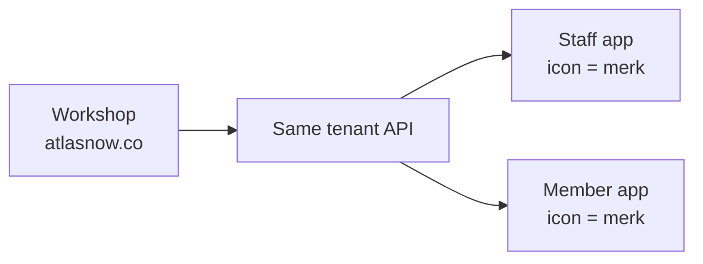

# White-label mobile — journey (pondasi, bukan jadwal rilis)

> [!info] How to read this
> **Masih lama.** Ini tangga pemikiran supaya web yang kita bangun sekarang tidak harus dirobek saat app merek mulai. Bukan sprint, bukan SOW App Store, bukan janji tanggal.
> Product language = English in decks. Merchant talk may be ID.

> [!success] Locked 2026-08-26
> **On the phone:** icon + application name = the merk.
> **Behind it:** AtlasNow data for that tenant only (members, stamps, chats, locations).
> Staff and members must not feel they are using “our” system.

Related lock: [[AtlasNow-Direction-PRD]] §6. Wave **I**. Web `atlasnow.co` stays the **workshop**; the phone app is the **storefront**.

---

## 0. Why a journey now

If we treat mobile as “a new product later,” we will copy members into a second database and paint AtlasNow on the icon. That is the thing brands refuse.

If we treat mobile as **the same tenant, another client**, then every web decision below is already the app:

| Keep doing on web | Pays off when mobile starts |
|---|---|
| One member = `phone` + `tenantId` | Member app login is that phone |
| Calon ≠ aktif (receipt first) | App cannot show a fake “you’re a member” |
| Loyalty redeem in Atlas, not in chat | Kasir app has a real button |
| HQ Cloud API only for send | App does not blast from a store phone |
| BrandingConfig per tenant | Store listing pack (name, icon, color) |
| Agency cannot see another agency | Agency app has no “all merks on earth” |

---

## 1. Who opens what

Three skins, **one engine**. Do not merge them into one binary members can switch.

| Journey track | Icon / name | Human | First jobs |
|---|---|---|---|
| **A. Workshop** | AtlasNow | Agency + Super Admin | What we ship today |
| **B. Staff storefront** | Merk (e.g. Vilo Gelato) | HQ, kasir, PIC | Struk, approve, redeem, cek member |
| **C. Member storefront** | Merk | Pelanggan | Stamp, ultah, join — no HQ chrome |

Agency-branded operator app (skin on track A) is optional and **later than B**. Members never see an agency switcher.

---

## 2. Journey stages (capability, not calendar)

Move to the next stage only when the **gate** is true. Dates stay empty on purpose.

### J0 — Pondasi web (now, ongoing)

**Intent:** Stop creating work we must undo.

- No table named `MobileMember`. No CSV “for the app.”
- Public join, member status, redeem, intakes stay tenant-scoped APIs a phone can call later.
- Branding pack on web: merk **name**, **logo**, colors. Missing logo = cannot list a store app.
- Auth can eventually mint **staff** vs **member** tokens for one tenant. Do not invent a third identity.

**Gate out of J0:** A merk can run join → receipt → aktif → redeem on web without a human editing the database. HQ WhatsApp send is allowed to still be “waiting on Meta.”

### J1 — Contract + branding pack

**Intent:** Mobile is a client, not a fork.

- Versioned HTTP API: member status, submit intake, redeem, branding (name, icon URL, splash color).
- Same honesty: no data → “no data”, not `0` sales.
- Per-tenant **store listing kit**: app name string, 1024 icon, splash, bundle id pattern `co.{merk}.staff` / `co.{merk}.member` (exact scheme later).
- Staff token ≠ member token. Member token cannot approve intakes.

**Gate:** One sandbox merk: a script (not an App Store build) can log in as kasir, look up a phone, and see calon/aktif from production-shaped data in staging.

### J2 — Staff app, one pilot merk

**Intent:** Kasir’s daily 15 seconds, with **their** icon.

- Surfaces: lookup member, submit struk, redeem stamp / birthday. No GBP charts.
- Offline: queue the receipt, do not invent a stamp on the device.
- Listing: **Vilo Gelato Staff** (or whatever they choose) — not AtlasNow.
- Crash/analytics: P2P sees technical errors; the merk does not see other merks.

**Gate:** One live outlet uses it for a real lunch rush without AtlasNow on the home screen. Web desk still works as fallback.

### J3 — Member app, same merk

**Intent:** Pelanggan opens **Vilo**, sees their stamps. Data is still AtlasNow.

- Login: phone they registered with (OTP/WA later — follow [[AtlasNow-WhatsApp-Decision]], no blast from this app).
- Shows: stamp progress, birthday window, “show this to kasir.” Does **not** self-redeem.
- Calon sees “belum aktif sampai belanja,” not a full card.
- Icon + name = merk. No AtlasNow wordmark unless they ask.

**Gate:** Same phone on web desk and in the member app shows the same count. No second member row.

### J4 — Factory (N merks, not N codebases)

**Intent:** Second merk is config + store listing, not a rewrite.

- One staff binary flavor + one member binary flavor, **branding injected per tenant** (or per build pipeline). Still **separate store listings**.
- Do not ship one “AtlasNow” listing and hide the name inside the app.
- Agency may request listings for merks they parent only.

**Gate:** Second merk listed without copying the Flutter/RN repo.

### J5 — Agency skin (optional)

**Intent:** Agency staff open *their* operator app, still AtlasNow data, still only their merks.

**Gate:** Super Admin cannot accidentally appear as that agency’s icon on a client’s phone.

---

## 3. What we do **not** do until a stage’s gate

| Temptation | Why not |
|---|---|
| Start a second Postgres “mobile” | Splits truth; stamps drift |
| One App Store app + brand switcher for customers | Breaks “this is Vilo” |
| Put AtlasNow on the member splash “for trust” | Opposite of the lock |
| Kasir-only webview of `atlasnow.co` with a custom icon | Still our URL, still our login chrome — last-resort prototype only, not the product |
| Native GBP dashboards in kasir app | [[AtlasNow-PRD]] §14.3: tasks, not charts |
| Invent visits so the member app looks busy | Honesty rule |

---

## 4. Technical north star (when we code)

- **API first.** Web and mobile call the same routes. New mobile field = new API field, then web, then app.
- **Tenant in the token**, never “pick a brand” after member login.
- **Branding is data** (`BrandingConfig` / pack), not a fork of `globals.css`.
- **Listings are many;** codebase is few.
- Unofficial WhatsApp / extra Chromium **does not** live on the phone app. Send path stays HQ Cloud API.

Stack choice (Flutter vs RN vs native) is **not locked**. Lock it at J1 when a pilot merk exists. Do not pick a stack in 2026 sales decks.

---

## 5. Open (not locked)

- Staff app first vs member app first if we can only staff one pilot — **recommendation: staff (J2)**. Kasir is daily; member is a card they already check at the till.
- OTP via SMS vs HQ WhatsApp for member login.
- Bundle ID / Apple Team / Play org: P2P publishes vs merk publishes (legal). Product still looks like the merk either way.
- Discreet “powered by AtlasNow” — **off unless the merk asks.**

---

## 6. One-line reminder

**They buy a Vilo app. We run AtlasNow behind it.** Workshop stays `atlasnow.co` until a gate says the storefront is ready.
